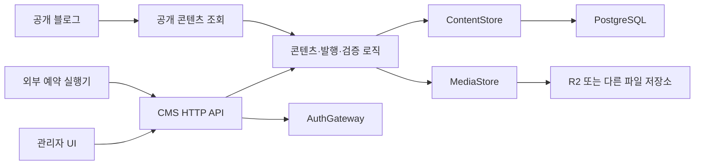

# bh2980 블로그 CMS v1 — 구현 명세

작성일: 2026-09-13 · 상태: **최종 승인 대기 / 구현 전**

이 문서는 기존 대화의 요구사항과 이후 변경 사항을 통합한 승인용 명세다. 합의하지 않았던 세부 사항에는 아래 기본값을 제안한다. 전체 명세 승인 후 구현하며, 문서 작성은 개발·데이터 이전·운영 전환의 실행 승인을 뜻하지 않는다.

## 1. 제품과 구현 범위

### 1.1 목표

개인 블로그의 콘텐츠를 웹에서 작성·정리·발행하는 1인용 CMS를 만든다. Keystatic의 본문 중심 디자인, 입력 즉시 서식이 적용되는 편집, MDX 저장, 관계 필드, 커스텀 컴포넌트의 장점을 유지한다. CMS 내부를 패치하지 않고 필드·본문 블록·저장소를 확장할 수 있어야 한다.

| 항목 | v1 기준 |
| --- | --- |
| 사용자 | 관리자 1명, PC 중심 |
| 주소 | 기존 블로그 `bh2980.com`, 관리자 `/admin` |
| 현재 배포 | Vercel. 핵심 CMS 규칙은 호스팅 서비스와 분리 |
| 콘텐츠 | DB가 원본. 본문은 MDX 문자열 |
| DB | 공통 PostgreSQL 구조. Supabase 또는 Neon 중 연결 가능한 서비스 사용 |
| 이미지 | 최초 R2 연결. 파일 저장 연결 모듈로 교체 가능 |
| 예산 | 유료 필수 기능 없이 무료 한도 내 운영을 목표로 설계 |
| 편집 | 시각 편집 기본, MDX 원문 토글 |
| 저장 | 브라우저 복구 + 서버 최신 초안 자동 저장 |
| 공개 | 최신 초안과 현재 공개본 구분. 명시적 발행으로 공개본 교체 |
| 이력 | 과거 버전 목록·비교·복원·발행 이력 누적 제외 |
| 예약 | 예정 시각·예약 조회·실행 API 제공. 시각에 맞춘 호출은 외부 실행기 담당 |
| 기존 콘텐츠 | 현재 공개 주소와 본문의 의미 유지, 검증 후 전환 |

### 1.2 기능 추적표

| ID | 구현 기능 | 주요 명세 |
| --- | --- | --- |
| F01 | 정보가 충분한 컬렉션 목록, 검색·필터·정렬·컬럼 설정 | §3 |
| F02 | 컬렉션 내부 가상 폴더 | §3.3 |
| F03 | 생성일·수정일 자동 관리, 발행일 분리 | §5.5 |
| F04 | 교체 가능한 DB·백엔드와 API 문서 | §2, §9, §10 |
| F05 | 이미지 업로드·압축·변환·파일명 정책과 연결 교체 | §7 |
| F06 | 블록 드래그·이동·복제·삭제 | §4 |
| F07 | 필드·목록·본문 블록 확장 API | §8 |
| F08 | 고정 ID 관계, 역참조, 참조 무결성 | §6, §9 |
| F09 | 태그·카테고리·폴더·상태의 일괄 작업과 삭제 | §3.4 |
| F10 | 초안·발행·예약·보관 및 상태 확장 | §5 |
| F11 | 자동 저장·저장 상태·복구 | §5.1 |
| F12 | 변경 이력 | 사용자 요청으로 v1 제외 |
| F13 | 콘텐츠 복제, 코드로 정의하는 템플릿 | §6.3 |
| F14 | 미디어 라이브러리·메타데이터·사용처 | §7 |
| F15 | 초안·발행의 검증 구분 | §5.6 |
| F16 | 내부 글 검색과 링크 삽입 | §6.2 |
| F17 | `/` 삽입 메뉴·명령 검색 | §4.2 |
| F18 | 텍스트 정렬·이미지 크기·배치 | §4.3 |
| F19 | MDX 원문 확인·수정 | §4.4 |

### 1.3 v1에서 하지 않는 일

- 복원용 변경 이력 저장과 관련 화면. 에디터의 실행 취소·다시 실행은 제공한다.
- 공동 편집, 여러 작성자의 역할·승인 단계, 공개 회원가입.
- 외부 예약 실행기의 구축·운영, 특정 제공자의 Cron 설정.
- 모바일 관리자 전용 UX. 공개 블로그의 모바일 반응형은 유지한다.
- 이미지 크롭·회전·자유로운 가로세로 비율 변경·본문의 이미지 감싸기. 이미지 너비·정렬·비율 유지와 기존 다단 배치는 제공한다.
- 임의 JavaScript 실행을 지원하는 MDX IDE, AI 기능, 플러그인 마켓플레이스, 관리자 화면에서 컬렉션 스키마를 만드는 빌더.

## 2. 기술 선택과 서비스 경계

### 2.1 선택안

| 영역 | 선택 | 이유와 경계 |
| --- | --- | --- |
| 앱·API | 기존 Next.js / React / TypeScript 프로젝트 | 초기에는 같은 저장소·배포에서 운영. CMS 업무 로직은 Route Handler 밖에 둔다 |
| UI | 기존 Tailwind·Radix 기반 UI·아이콘·cmdk 재사용 | 목록과 편집 화면의 스타일을 직접 제어 |
| 시각 에디터 | Tiptap 3의 공개 소스 패키지와 React NodeView | ProseMirror 기반의 확장과 React 편집 UI를 사용. 기존 PM 관련 로직은 호환성을 검증하여 재사용 |
| MDX 변환 | 기존 unified·remark·MDX AST 도구와 필요한 stringify 도구 | 기존 문법을 기준으로 MDX ↔ 편집기 문서 변환. Tiptap의 일반 Markdown 변환에 MDX 지원을 가정하지 않음 |
| 공개 렌더링 | 기존 MDX 컴포넌트, Shiki·KaTeX·Mermaid·차트 로직 | CMS 전용 노드 이름이 공개 본문에 새어 나오지 않게 한다 |
| 필드 검증 | 기존 Zod + CMS 필드 정의 | 클라이언트 안내와 서버의 권위 있는 검증 |
| DB 접근 | `pg` 기반 PostgreSQL 연결과 SQL 마이그레이션 | 일반 PostgreSQL 기능을 사용. 제공자별 데이터 API·Auth·전용 RPC를 전제로 하지 않음 |
| 인증 | Auth.js + GitHub OAuth, DB 어댑터 없는 JWT 세션 | GitHub 계정의 고정 ID로 관리자 1명 제한. DB 서비스 교체와 로그인 분리 |
| 파일 저장 | S3 호환 클라이언트를 사용하는 R2 연결 모듈 | 업로드 서명·확인·주소 조회·삭제만 연결 모듈이 담당 |
| 브라우저 복구 | IndexedDB, 작은 연결 도구 사용 가능 | 최신 복구본을 유지. 협업·변경 이력 엔진은 도입하지 않음 |
| 검증 도구 | 기존 Vitest·Testing Library·TypeScript·Biome와 브라우저 검수 | 기존 테스트를 살리고 핵심 경계만 추가 검증 |

Tiptap은 React NodeView를 제공하며, 공개 저장소의 라이선스는 MIT다. 이 선택은 무료 공개 패키지 범위에 한정한다. [React NodeView 문서](https://tiptap.dev/docs/editor/extensions/custom-extensions/node-views/react), [라이선스](https://github.com/ueberdosis/tiptap/blob/main/LICENSE.md)

새 의존성은 편집기·DB·인증·파일 저장에 필요한 것만 추가한다. 실제 패치 버전은 구현 시 기존 Next.js·React와의 호환성을 확인하여 lockfile에 고정한다. 공급자의 유료 편집·변환·이력 서비스는 필수 조건으로 삼지 않는다.

### 2.2 구조



- `ContentStore`: 콘텐츠·폴더·관계의 조회와 원자적인 변경. DB 드라이버와 SQL은 이 구현 안에 둔다.
- `MediaStore`: 파일 업로드 준비, 업로드 결과 확인, 파일 주소 조회, 삭제. 이미지 메타데이터는 CMS DB에서 관리한다.
- `AuthGateway`: 현재 사용자와 호출 권한 확인. 서비스별 세션과 OAuth 규칙은 여기에서 처리한다.
- HTTP API는 관리자 화면의 계약이다. 같은 프로세스의 공개 블로그는 공통 조회 로직을 직접 호출해 자기 서버로 HTTP 요청을 반복하지 않는다. 외부 블로그용 공개 API도 같은 결과를 제공한다.
- 백엔드 전체 교체 시 동일 HTTP 규격을 구현한다. 기본은 `/api/cms/v1` 경로를 유지하는 프록시·라우팅으로 연결하며, 세션도 같은 사이트에서 동작하도록 한다.
- UI 컴포넌트·필드 정의에 DB 비밀키, 스토리지 비밀키, 제공자 SDK의 응답 타입을 전달하지 않는다.
- 서비스 교체는 데이터·파일 이전과 검증을 포함한다. 새 제공자에 데이터가 없는 상태에서 연결 주소만 바꾸면 이전이 끝난 것으로 취급하지 않는다.

## 3. 화면과 콘텐츠 관리

### 3.1 화면 배치

목록 화면은 왼쪽 탐색 영역과 오른쪽 콘텐츠 영역으로 구성한다. 별도 통계 대시보드는 만들지 않고 마지막 컬렉션을 연다.

```text
┌ 컬렉션·폴더 ┬ 검색 / 필터 / 정렬 / 컬럼                 새 글 ┐
│ 게시글      │ 제목       상태       수정일       태그 ...    │
│ 메모        │ □ ...                                        │
│  전체 메모  │ □ ...                                        │
│  미분류     │                              페이지 이동      │
│  알고리즘   │                                               │
│  Type ...   │                                               │
│ 미디어      │                                               │
└─────────────┴───────────────────────────────────────────────┘
```

편집 화면은 본문에 집중할 수 있도록 탐색 영역과 속성 패널을 각각 접을 수 있게 한다.

```text
┌ 목록으로 / 현재 위치 ── 저장 상태 ── 시각·MDX 토글 / 저장 / 발행 ┐
│ 탐색(접기) │                    제목              │ 속성(접기) │
│            │  본문 도구 모음                      │ 상태       │
│            │                                      │ 카테고리   │
│            │  블로그와 유사한 스타일의 편집 본문   │ 태그       │
│            │                                      │ slug·날짜  │
│            │                                      │ 정책 등    │
└────────────┴──────────────────────────────────────┴────────────┘
```

- 기준 검수 화면: 너비 1280px 이상 PC. 1024px에서는 패널을 접어 본문 편집이 가능해야 한다.
- 본문 기본 최대 너비 800px, 속성 패널 약 300px, 탐색 영역 약 240px. 좁아지면 본문 영역을 우선한다.
- 한국어 UI와 기존 디자인 토큰을 사용한다. 밝은·어두운 테마를 제공한다.
- 글 제목은 본문 위에 크게 표시한다. 기본 편집 화면에 MDX 소스와 별도 미리보기를 나란히 강제하지 않는다.
- 실제 공개 레이아웃은 인증된 미리보기에서 확인할 수 있다. 미리보기는 공개 상태를 바꾸지 않는다.

### 3.2 목록

- 게시글 기본 컬럼: 제목, 상태, 카테고리, 태그, 수정일, 발행일.
- 메모 기본 컬럼: 제목, 상태, 태그, 수정일, 발행일.
- 생성일, slug, 폴더를 추가할 수 있고 컬럼 숨김·순서 변경을 지원한다.
- 기본 정렬: 수정일 내림차순. 동일 값은 고정 ID로 순서를 안정화한다.
- 페이지당 기본 25개, 선택값 25/50/100. 검색·정렬·페이지 처리는 서버에서 수행한다.
- 검색은 기본적으로 제목·slug, 선택 옵션으로 본문 일반 텍스트를 포함한다. 한국어 부분 문자열 검색을 지원하며 별도 검색 서비스는 사용하지 않는다.
- 필터: 공개 상태, 수정 중 여부, 예약 여부, 태그, 카테고리, 생성·수정·발행일 범위. 다른 필터끼리는 AND, 같은 필터의 여러 선택값은 OR다.
- 폴더 선택·검색·필터·정렬은 URL에 반영해 뒤로 가기로 복구한다. 컬럼 설정·페이지 크기는 컬렉션별 사용자 설정에 저장한다.
- 여러 개의 이름 붙인 저장된 보기 화면은 v1에 추가하지 않는다. 현재 설정을 기억하는 기능을 제공한다.
- 빈 결과, 로딩, 오류와 재시도를 구분한다. 읽기 전용 표시에는 상태를 색상만으로 전달하지 않는다.

### 3.3 가상 폴더

- 폴더는 컬렉션별 관리자 전용 분류이며 글 주소·태그·카테고리를 바꾸지 않는다.
- 글 하나는 한 폴더에 속하거나 미분류다. `전체`에는 모든 글을, `미분류`에는 폴더가 없는 글만 표시한다.
- 폴더를 선택하면 기본적으로 그 폴더에 직접 속한 글을 표시한다. `하위 폴더 포함`을 켜면 자손 폴더의 글도 포함한다.
- 하위 폴더 생성, 이름 변경, 순서 변경, 폴더 이동을 제공한다. 순환 구조와 같은 부모 안의 중복 이름을 거부한다.
- 글은 드래그 또는 일괄 이동 메뉴로 이동한다. 폴더 간 이동은 콘텐츠 수정일을 바꾸지 않는다.
- 폴더 삭제는 내용물을 미리 보여준 뒤 진행한다. 직접 속한 글과 자식 폴더를 삭제할 폴더의 부모로 옮긴다. 부모가 없으면 글은 미분류, 자식 폴더는 최상위로 옮긴다.
- 폴더 이름 충돌이 생기면 해당 이동을 완료하기 전에 이름을 변경하도록 안내한다. 폴더 삭제로 글을 삭제하지 않는다.
- 서로 다른 컬렉션 간 이동은 지원하지 않는다. 스키마가 다른 콘텐츠의 변환은 별도 이전 작업이다.

### 3.4 일괄 작업

- 현재 페이지의 개별 선택·전체 선택을 제공한다. 보이지 않는 모든 검색 결과까지 자동 선택하지 않는다.
- 태그 추가·제거, 카테고리 변경, 폴더 이동, 보관, 보관 해제, 휴지통 이동, 발행을 지원한다.
- 일괄 수정한 태그·카테고리는 수정 초안에 저장한다. 공개본 변경은 발행을 통해 진행한다.
- 예약 중인 글은 편집 작업 전에 예약 해제가 필요하다. 일괄 발행은 각 항목에 발행 검증을 적용한다.
- 항목 단위로 원자적으로 처리한다. 결과에 성공·실패를 구분하고 실패한 항목만 다시 실행할 수 있다. 일부 실패를 전체 성공처럼 표시하지 않는다.
- 일괄 API는 최대 100개 ID와 각 항목의 버전을 받는다. 오래된 목록에서의 변경은 충돌로 반환한다.

## 4. 에디터와 MDX

### 4.1 지원 범위

- 문단, 제목 H2~H6, 굵게, 기울임, 취소선, 밑줄, 인라인 코드, 인용, 수평선, 링크, 줄바꿈.
- 순서·비순서·체크 목록, 중첩 목록, 기본 표와 행·열 추가/삭제. 셀 병합은 v1 범위가 아니다.
- 코드 블록: 언어, 제목, 줄 번호, 현재 코드 주석 문법에 의한 줄·문자 강조, 툴팁, 접기.
- 기존 Callout, Collapsible, Tabs/Tab, Columns/Column, Tooltip, 위첨자·아래첨자·IdeographicSpace.
- Mermaid, 현재 Chart DSL의 bar/line/area/pie, 블록 수식.
- 기존 `$...$`의 일반 텍스트 렌더링 정책은 유지한다. 블록 수식은 기존 `$$...$$` 형식을 유지한다.
- 기존 이미지 문법과 새로운 크기·정렬이 있는 이미지 블록.
- 알 수 없는 코드 언어는 일반 코드로 표시하며 내용은 보존한다.
- 블록별 설정 필드와 본문 내부에서 편집되는 자식 콘텐츠를 구분한다. Tabs는 2~8개, Columns는 2~4개라는 기존 기본 제약을 유지한다.

### 4.2 입력과 블록 조작

- `## `, 목록 기호, 인용 기호, 코드 펜스 등의 입력으로 현재 위치의 서식을 전환한다.
- 빈 문단 시작의 `/`는 블록 삽입 메뉴를 연다. 한국어 이름·영문 이름으로 검색하고 방향키·Enter·Escape로 조작한다.
- `Cmd/Ctrl+K`는 CMS 명령 검색, `Cmd/Ctrl+S`는 즉시 저장, `Cmd/Ctrl+Z`와 플랫폼 기본 다시 실행 키를 지원한다.
- 각 블록에 핸들과 메뉴를 제공한다. 메뉴에는 위·아래 이동, 복제, 삭제를 제공하며 마우스 없이도 실행할 수 있다.
- 기본 문단과 커스텀 블록을 공통 조작 대상으로 삼는다. 중첩 이동은 해당 부모가 허용하는 구조 안에서만 가능하다.
- 복제 시 내부 편집용 블록 ID는 새로 만든다. 참조하는 글·미디어 ID는 유지한다.
- 코드 영역은 코드 붙여넣기, 들여쓰기, 줄바꿈, 선택 범위 조작을 지원한다. 본문 단축키가 코드 입력을 방해하지 않아야 한다.
- 한글 IME 조합 중 Enter·Backspace·명령 메뉴·자동 저장이 글자 중복이나 누락을 만들지 않아야 한다.

### 4.3 정렬과 이미지 크기

- 문단·제목에 왼쪽·가운데·오른쪽 정렬을 적용한다. 여러 문단을 선택해 함께 변경할 수 있다.
- 정렬은 컨테이너 전체의 암묵적 상속보다 해당 문단·제목의 속성으로 관리한다. 코드 내용의 들여쓰기는 정렬 기능으로 바꾸지 않는다.
- 이미지 정렬은 텍스트 정렬과 독립적이다. 너비를 드래그하거나 숫자로 지정한다.
- 기본 너비는 본문에 맞춤이며 원본보다 자동 확대하지 않는다. 명시적 입력은 px 또는 %이고, % 기준은 이미지가 속한 본문·컬럼의 너비다.
- 너비 입력 범위는 1~100% 또는 양의 정수 px, 최대 4096px다. 실제 표시는 컨테이너의 100%를 넘지 않는다.
- 높이는 원본 비율로 계산한다. 키보드로도 숫자 입력과 정렬을 변경할 수 있다.
- 이미지의 크기·배치·alt·caption은 삽입 위치별 속성이다. 같은 미디어를 다른 글에서 사용한 값에 영향을 주지 않는다.

### 4.4 MDX 저장 계약

- DB에 저장하는 본문 원본은 MDX 문자열이다. 편집기의 JSON 문서는 편집 중 표현이며 별도의 콘텐츠 원본으로 병행 저장하지 않는다.
- 경로: `MDX → remark/MDX AST → CMS 변환 → Tiptap 문서`, 저장은 역방향이다.
- 일반 문법은 Markdown으로, 기존 등록 컴포넌트는 현재 MDX 컴포넌트 이름으로 저장한다.
- 코드, Mermaid, 차트는 각각 기존 언어가 지정된 코드 펜스로 저장한다. 코드 주석의 내용·공백·범위를 보존한다.
- 시각 모드를 열었다가 원문으로 돌아오는 것만으로 원문을 재직렬화하지 않는다. 실제 시각 편집 후에는 문법 포맷 정규화를 허용하되 텍스트·코드·블록 속성·중첩 구조의 의미를 보존한다.
- 기존 이미지 ``를 읽는다. 크기·정렬·caption 또는 미디어 참조가 있는 이미지는 아래 `Image` 컴포넌트 형식을 사용한다.
- 등록된 JSX 컴포넌트와 문자열·숫자·불리언·null·JSON 배열/객체의 정적 속성값을 지원한다. 기존 `defaultOpen={true}` 같은 리터럴은 허용한다.
- 본문에서 임의 함수 호출·변수 참조·spread 속성·import/export·스크립트·이벤트 핸들러는 실행하지 않는다. 코드 펜스 안의 프로그램 예제는 일반 텍스트이므로 허용한다.
- 지원하지 않는 문법은 원문에서 그대로 보존하며 오류 위치를 표시한다. 그 문서의 시각 모드 전환과 발행을 제한하고, 초안 저장·원문 복사는 허용한다. 조용히 노드를 삭제하거나 임의의 HTML로 바꾸지 않는다.
- 렌더링 전에 서버에서도 동일 허용 규칙을 검사한다. MDX 문자열을 사용자 입력 상태 그대로 실행 경로에 넘기지 않는다.

추가 저장 문법의 계약:

```mdx
<TextAlign align="center">

## 가운데 제목

</TextAlign>

<Image mediaId="미디어-UUID" alt="설명" width="60%" align="center" caption="캡션" />

<ContentLink entryId="콘텐츠-UUID">직접 입력한 링크 텍스트</ContentLink>
```

- `TextAlign`은 하나의 문단·제목을 감싸며 기본 왼쪽 정렬에는 생략한다. 제목의 텍스트·수준은 목차에 그대로 반영한다.
- `Image`는 등록 미디어의 `mediaId` 또는 외부 이미지의 `src` 중 하나를 사용한다. 공개 주소 해석은 렌더러가 담당한다.
- 장식 이미지는 `decorative={true}`와 빈 alt로 저장한다. 일반 링크와 이미지 주소는 허용된 http/https 또는 사이트 상대 경로만 사용하며 `javascript:` 같은 실행 가능한 URL은 거부한다.
- `ContentLink`는 고정 ID로 현재 공개 주소를 구한다. 원문의 UUID를 편집 화면에서는 제목으로 표시한다.
- 내보낼 때 현재 주소를 사용하는 일반 링크·이미지로 변환하는 옵션을 제공한다. 크기·정렬 등의 표현을 유지하려면 관련 컴포넌트 계약도 함께 제공한다.

## 5. 저장·상태·발행

### 5.1 자동 저장과 복구

- 본문이 있는 게시글·메모는 입력이 2초 멈추면 서버에 저장한다. 계속 입력할 때도 마지막 서버 저장 이후 최대 10초마다 최신 변경을 전송한다. IME 조합 도중에는 조합 종료까지 미룬다.
- 자동 저장은 서버 최신 초안을 덮어쓴다. 입력이 없거나 값이 동일하면 요청과 수정일 변경을 생략한다.
- 브라우저 복구본은 마지막 변경 후 500ms를 기본으로 갱신한다. 관리자 ID·콘텐츠 ID를 키로 하여 다른 계정의 복구본을 섞지 않는다.
- 요청은 문서당 하나씩 전송한다. 전송 중의 새 입력은 다음 요청에 최신 상태로 합쳐 보낸다.
- 수동 저장은 대기 중인 요청 뒤에 최신 상태를 즉시 반영한다. 저장과 발행 모두 변경 이력을 만들지 않는다.
- 상태 표시: `변경 있음`, `저장 중`, `서버에 저장됨`, `브라우저에만 임시 저장됨`, `저장 실패`, `충돌`.
- 서버가 확인한 저장 순번과 현재 변경 순번이 같을 때만 완료로 표시한다. 오래된 응답이 새 입력까지 저장한 것으로 표시하지 않는다.
- 연결 실패 시 복구본을 유지하고 재시도 버튼을 제공한다. 연결 복귀 후 서버 버전을 먼저 확인한다. 자동 재시도는 2·5·15초 후까지 수행하고 이후 수동 재시도 또는 연결 복귀를 기다린다.
- 새로 열었을 때 서버와 같은 버전을 바탕으로 한 더 최신 복구본이 있으면 복구 여부를 안내한다. 서버도 바뀌었다면 덮어쓰지 않고 충돌 화면에서 양쪽 내용을 확인·복사할 수 있게 한다.
- 서버보다 오래된 복구본은 적용하지 않는다. 서버에 동기화된 복구본은 삭제하며, 미동기화 복구본은 자동 만료시키지 않는다. 브라우저 데이터 삭제·저장 공간 거부 등으로 복구가 불가능할 수 있음을 상태에 정확히 표시한다.
- 서버 미저장 변경이 있으면 페이지 이탈 경고를 제공한다. 종료 직전 전송이 반드시 성공한다고 가정하지 않는다.
- 단일 작성자라도 여러 탭·PC의 동시 수정은 버전 검사로 감지한다. 실시간 병합과 협업은 하지 않는다.

### 5.2 초안과 공개본

- 새 게시글·메모는 제목·slug·본문이 비어 있는 상태로 초안을 시작할 수 있다. UI에 `제목 없는 글`로 표시하되 실제 제목에 그 문자열을 강제 저장하지 않는다.
- 현재 작업 값과 공개 값은 본문뿐 아니라 제목·slug·요약·태그·카테고리·정책 등 발행에 영향을 주는 모든 필드를 포함한다.
- 발행은 최신 저장 성공을 확인하고 서버 검증을 거쳐 작업 값을 현재 공개본에 원자적으로 반영한다.
- 공개된 글을 편집하면 공개본은 유지하고 `발행됨 · 수정 중`으로 표시한다. 변경사항 발행 전에는 공개 제목·주소·본문·관계가 바뀌지 않는다.
- 과거 초안이나 과거 발행본은 보관하지 않는다. 내용 비교용 누적 테이블·화면을 만들지 않는다.
- 태그·카테고리·모음집은 기본적으로 작은 레코드 편집 폼을 사용한다. `저장`이 검증 후 현재 값에 즉시 반영되는 `record` 방식이며 별도의 발행 버튼은 없다. 이 폼에는 자동 서버 저장을 적용하지 않고 변경 중 이탈을 안내한다.
- 코드 정의의 `workflow: "publish" | "record"`로 두 동작을 선택한다. 일반 콘텐츠 컬렉션은 publish, 분류용 컬렉션은 record를 기본으로 한다.

### 5.3 상태 전환

| 현재 상태·동작 | 결과 |
| --- | --- |
| 초안 → 발행 | 검증 성공 시 공개본 생성 |
| 발행 → 편집·저장 | 공개본 유지, 수정 초안 갱신 |
| 발행 → 변경사항 발행 | 공개본 교체 |
| 초안/발행 → 보관 | 공개 종료, 예약 취소, 관리자에서 보존 |
| 보관 → 보관 해제 | 초안으로 복귀. 자동으로 다시 공개하지 않음 |
| 초안/발행/보관 → 휴지통 | 공개 종료, 예약 취소, 기본 목록에서 숨김 |
| 휴지통 → 복원 | publish 컬렉션은 초안으로 복귀. record 컬렉션은 현재 값과 관계를 검증한 뒤 활성 레코드로 복원 |
| 휴지통 → 영구 삭제 | 참조 검증과 별도 확인 후 삭제 |

- 보관·휴지통의 공개 주소는 404를 반환하고 목록·RSS·sitemap에서 제외한다. 관리자 미리보기는 인증을 확인한다.
- 휴지통은 자동으로 비우지 않는다. 영구 삭제는 휴지통 화면에서만 제공하며 일괄 영구 삭제는 v1에서 제공하지 않는다.
- 기본 상태는 초안·발행·예약·보관이다. 예약은 별도 속성으로 관리하여 `발행됨 · 변경 예약`을 표현할 수 있다.
- 추가 편집 상태는 코드에서 이름·라벨과 `draft/published/archived` 기본 의미의 매핑으로 정의할 수 있다. 공개로 전환하는 상태는 항상 발행 검증과 명시적 발행 API를 거친다.
- 기존 `normal/evergreen/deprecated` 정책은 게시글의 별도 필드로 보존한다. `deprecated`를 보관 상태로 자동 변환하지 않는다.
- 위 초안·발행·예약·보관 전환은 publish 컬렉션에 적용한다. record 컬렉션은 활성/휴지통을 사용하며 저장과 복원이 공개 분류 정보에 즉시 반영됨을 버튼과 안내에 표시한다.

### 5.4 예약

- 예약 등록은 서버에 저장된 초안을 발행 검증한 뒤 미래의 예정 시각과 새로운 예약 ID를 기록한다. 저장 시간은 UTC, 입력·표시는 서울 시간이다.
- 신규 글과 이미 공개된 글의 변경사항 모두 예약할 수 있다. 공개 중인 글은 실행 전까지 현재 공개본을 유지한다.
- 예약된 초안의 본문·메타데이터는 잠근다. `예약 해제 후 편집`을 누르면 잠금을 풀고 기존 공개 상태를 유지한다. 폴더 이동은 가능하다.
- 잠금으로 예약 대상 내용을 유지하며, 별도 과거 버전이나 예약 스냅샷을 누적하지 않는다.
- 예정 시각이 되어도 CMS 자체에서 실행기를 돌리지 않는다. 외부 실행기가 예약 조회 API와 예약 발행 API를 호출한다.
- 실행 시 예약 ID·예정 시각·현재 상태와 발행 조건을 다시 검사한다. 변경·취소된 예약, 아직 이르거나 이미 완료한 예약을 잘못 실행하지 않는다.
- 같은 예약의 중복 호출은 중복 발행하지 않는다. 실패 시 공개본을 유지하고 원인을 관리자에게 표시한다.
- 예약 중 관계 대상이 보관되거나 삭제되는 등 조건이 달라지면 실행을 실패 처리한다. 수정은 예약 해제 후 가능하다.
- 정확한 호출 시각과 외부 실행기의 재시도 운영은 사용자가 연결하는 실행기의 책임이다. CMS에는 예정 시각과 실행 결과를 명확히 표시한다.

### 5.5 날짜

| 필드 | 의미 |
| --- | --- |
| `createdAt` | 새 콘텐츠가 서버에 처음 생성된 시각. 서버 지정, 변경하지 않음 |
| `updatedAt` | 실제 본문·메타데이터가 마지막으로 바뀐 시각. 같은 값 저장·폴더 이동에는 변경하지 않음 |
| `firstPublishedAt` | 처음 공개된 실제 시각. 이후 발행으로 덮어쓰지 않음 |
| `lastPublishedAt` | 공개본이 마지막으로 갱신된 시각 |
| `publishedAt` | 블로그에 표시하고 정렬에 사용하는 발행일. 첫 발행 기본값은 발행 시각, 사용자가 과거 날짜를 지정할 수 있음 |
| `scheduledAt` | 외부 실행기가 발행을 수행할 예정 시각 |

- 실제 공개 여부는 상태와 공개본으로 판단한다. `publishedAt`에 미래 시각을 넣어 예약 기능을 우회하지 않는다.
- 저장은 UTC, 기본 표시는 `Asia/Seoul`이다. 시간대 설정은 CMS 설정에서 바꿀 수 있다.
- 기존 파일에 생성일·수정일이 없으면 null로 이전해 `기록 없음`으로 표시한다. 이전일은 `importedAt`으로 따로 기록한다.
- 기존 `publishedDateTimeISO`는 표시 발행일로 이전한다. 실제 최초·최종 공개 시각을 알 수 없으면 추정해서 채우지 않는다.
- 공개 블로그의 수정일은 현재 공개본을 만들 때의 내용 수정일이다. 아직 발행하지 않은 초안 수정일을 공개 페이지에 노출하지 않는다.

### 5.6 검증

- 모든 쓰기에서 로그인·권한·형식·크기·허용 필드·ID·버전을 서버에서 검사한다.
- 초안은 제목·요약·카테고리가 없어도 저장할 수 있고, 오류 있는 MDX 원문도 보존한다.
- 발행 필수: 제목, 고유한 slug, 본문, 게시글의 카테고리, 해석 가능한 허용 MDX, 유효한 관계·미디어, 블록별 필수 속성.
- 요약은 비어 있으면 일반 텍스트에서 자동 생성하며 발행 전 결과를 보여준다. 생성할 텍스트가 없으면 직접 입력하도록 한다.
- 제목·slug와 필수 필드의 오류는 해당 필드로 연결한다. 본문 오류에는 위치와 원인을 표시한다.
- 이미지 alt 또는 장식 이미지 표시를 제공한다. 설명이 필요한 새 이미지의 alt 누락은 발행 전 보완하도록 한다. 기존 이미지의 빈 alt는 이전 보고서에 표시하여 전환 검수에서 처리한다.
- 미발행 콘텐츠를 향한 공개 내부 링크는 발행을 막고 대상 공개 또는 링크 수정이 필요함을 안내한다.
- 콘텐츠 최대 본문 2MiB, JSON 메타데이터 256KiB, 제목 200자, slug 200자를 기본으로 한다. 서버 설정과 API 메타데이터에 같은 제한을 표시한다.

## 6. 관계, 주소, 복제와 템플릿

### 6.1 고정 ID와 참조

- 모든 콘텐츠·폴더·미디어에 변경되지 않는 UUID를 부여한다. 관계 필드는 slug 대신 ID를 저장하고, 단일·다중 선택과 다중 선택의 순서를 지원한다.
- 관계 선택기는 제목·이름으로 검색하며 컬렉션, 상태, slug를 함께 보여준다. 필드별 허용 컬렉션과 검색 조건을 코드로 지정한다.
- 상세 화면의 `사용처`에서 필드 관계와 본문 내부 링크를 역참조한다. 최신 초안과 현재 공개본의 사용처를 구분한다.
- 관계 인덱스는 메타데이터와 MDX에서 추출하여 콘텐츠 저장과 같은 DB 트랜잭션으로 갱신한다. ID의 존재는 DB 외래 키로 보장하고, 허용 컬렉션·공개 조건은 서비스에서 검증한다.
- 문법 오류가 있는 원문 초안은 마지막으로 분석한 참조를 유지하고 `참조 확인 필요`로 표시한다. 관련 컬렉션에 분석하지 못한 초안이 있으면 참조 검사를 완료하기 전까지 해당 유형의 영구 삭제를 막는다. 초안 저장 자체는 허용한다.
- 사용 중인 태그·카테고리는 참조를 바꾸거나 제거하기 전까지 휴지통 이동·영구 삭제를 막는다. 공개본에서도 사용 중이면 해당 글의 변경사항을 발행해야 참조가 해제된다.
- 게시글의 보관·휴지통 이동은 연결된 공개 글이 있으면 사용처를 보여준 뒤 진행한다. 이후 공개 렌더러는 비공개 대상을 향한 `ContentLink`를 링크 없는 텍스트로 표시하고, 관련 글 목록에서는 제외한다. 본문을 자동 수정하지 않는다.
- 삭제된 대상을 참조하는 초안은 발행할 수 없다. 영구 삭제는 초안·공개본의 참조가 모두 해제되어야 가능하다. 사용 중인 대상을 강제로 연쇄 삭제하지 않는다.

### 6.2 slug와 내부 링크

- slug는 컬렉션 안에서 고유하며 한글을 지원한다. 새 입력은 NFC로 정규화하고 앞뒤 공백을 제거한다. `/`, `?`, `#`, 제어문자와 빈 값을 발행 시 허용하지 않는다. 기존 주소의 인코딩·정규화 차이는 이전 검수에서 확인한다.
- 초안의 새 slug도 서버 저장 시 예약하여 중복을 발견한다. 아직 slug가 없는 초안은 저장할 수 있다.
- 발행된 글의 slug 수정은 초안에만 저장된다. 변경사항을 발행하면 새 주소를 사용하고 이전 공개 주소는 같은 콘텐츠 ID로 308 리다이렉트한다.
- record 컬렉션의 slug 변경은 명시적 저장 시 현재 주소와 별칭을 함께 갱신한다. 초안의 예약 slug를 다시 바꾸면 공개된 적 없는 이전 예약은 해제한다.
- 이전 주소는 새 콘텐츠에 재사용하지 않는다. 별칭은 직접 ID를 가리켜 여러 번 변경해도 리다이렉트가 이어지지 않는다. 보관·휴지통 상태에서는 별칭도 404를 반환한다.
- 영구 삭제된 공개 주소는 재사용 방지 기록만 남긴다. 제목·본문·미디어·과거 버전은 이 기록에 보관하지 않는다. 공개된 적 없는 초안의 예약 주소는 삭제 시 해제한다.
- 에디터에서 `[[`를 입력하거나 링크 메뉴의 `내부 글`을 선택하면 제목 검색을 제공한다. 직접 URL을 찾지 않고 ID를 가진 `ContentLink`를 삽입한다.
- 기본 링크 텍스트는 삽입 당시 제목이며 직접 수정할 수 있다. 대상 제목이 바뀌어도 작성자의 링크 문구를 자동 교체하지 않는다. 대상 주소는 렌더링 시 현재 공개본에서 계산한다.
- 초안 대상 링크는 편집 중 허용하되 상태를 표시한다. 발행 시에는 공개 가능한 대상을 요구한다. 일반 외부 링크도 함께 지원한다.

### 6.3 복제와 템플릿

- 복제는 기본적으로 원본의 최신 초안 본문·필드·관계를 새 ID로 복사한다. 제목은 `원본 제목 (복사)`로 시작하고 slug는 비워 둔다. 발행 상태·일정·공개본·생성/수정 시각은 복사하지 않는다.
- 복제한 콘텐츠는 원본과 같은 가상 폴더의 새 초안이 된다. 이미지 파일을 다시 올리지 않고 기존 미디어를 참조한다.
- 템플릿은 컬렉션 코드에 `id`, 표시 이름, 기본 필드, MDX 본문으로 정의한다. `새 글`에서 빈 글 또는 템플릿을 선택한다.
- 템플릿의 변경은 이후 생성하는 글에만 적용한다. UI에서 템플릿을 편집·발행하는 별도 관리 기능은 v1 범위에 넣지 않는다.
- 첫 템플릿 예시는 일반 게시글, 알고리즘 풀이 메모, Type Challenge 풀이 메모로 제공한다. 구조와 기본 코드는 사용자가 컬렉션 설정에서 바꿀 수 있다.

### 6.4 최초 컬렉션

| 컬렉션 | 필드와 동작 |
| --- | --- |
| `post` | 제목, slug, 요약, 카테고리, 태그, 표시 발행일, MDX 본문, 기존 normal/evergreen/deprecated 정책과 대체 글 관계. 초안/발행 workflow |
| `memo` | 제목, slug, 태그, 표시 발행일, MDX 본문. 초안/발행 workflow |
| `category` | 이름과 slug. 명시적 저장으로 반영하는 record workflow |
| `tag` | 이름과 slug. 명시적 저장으로 반영하는 record workflow |
| `collection` | 모음집 이름, slug, 설명, 순서를 유지하는 게시글 관계. record workflow |

공통 시스템 필드와 가상 폴더는 CMS가 제공한다. 기존 공개 블로그가 받는 필드 이름은 호환 변환 계층에서 유지할 수 있다. 모음집에서 아직 공개되지 않은 게시글은 관리자에게 표시하고 공개 목록에서는 제외한다.

## 7. 이미지와 미디어 라이브러리

### 7.1 업로드와 표현

- 드래그 앤 드롭, 붙여넣기, 파일 선택, 라이브러리 재사용으로 이미지를 삽입한다. 업로드 중에는 위치를 유지하는 임시 블록과 진행/오류 상태를 보여준다. 업로드에 실패한 상태로 발행하지 않는다.
- 기본 업로드는 원본 유지다. 업로드 패널에서 `웹용 최적화`를 선택할 수 있고 기본 정책은 코드로 바꿀 수 있다.
- 기본 최적화는 정적 JPEG·PNG·WebP를 대상으로 긴 변 최대 2560px, 확대 없음, WebP 품질 0.9로 제안한다. 포맷·최대 크기·품질·파일명 정책을 업로드 처리 함수로 교체한다.
- 최적화 기능은 브라우저의 이미지/Canvas 기능을 우선 사용한다. 애니메이션 GIF·WebP와 변환 지원이 불확실한 이미지는 원본을 유지한다. 애니메이션을 조용히 정지 이미지로 바꾸지 않는다.
- 변환한 경우 원본과 공개용 파일을 같은 미디어 레코드에 연결한다. 원본 유지 모드는 파일 하나만 저장한다. 업로드 전 변환 결과와 파일 용량을 확인할 수 있다.
- 기본 허용 형식은 JPEG·PNG·WebP·GIF·AVIF, 원본 파일당 최대 10MiB·4천만 픽셀이다. SVG와 기타 파일은 기본 허용하지 않는다. 서버에서도 실제 파일 형식·크기와 이미지 메타데이터를 검증하며 클라이언트의 MIME 정보만 신뢰하지 않는다.
- 이미지 너비·정렬·alt·caption은 본문에 삽입된 이미지별 속성이다. 이미지 원본의 픽셀 크기와 글에서 표시하는 너비를 구분한다.
- URL은 미디어 ID를 통해 저장 모듈에서 해석한다. DB에는 제공자 계정 주소 대신 저장 키와 파일 정보를 보관한다. 저장소를 옮겨도 본문의 미디어 ID를 바꿀 필요가 없어야 한다.
- 기존 MDX의 상대 이미지 경로·외부 HTTPS 이미지 주소도 읽을 수 있다. 외부 이미지를 자동 다운로드하지 않는다. 새 이미지의 기본 경로는 미디어 ID 방식이다.

### 7.2 업로드 계약

1. 인증된 클라이언트가 파일명·예상 형식·크기와 변환 계획을 보내 업로드를 준비한다.
2. 서버가 허용 크기·형식·사용자와 파일 키를 결정한다. 저장 모듈은 제한된 유효 기간의 직접 업로드 URL 또는 자체 업로드 API 정보를 반환한다.
3. 클라이언트가 파일을 전송하고 완료 API를 호출한다. 서버가 저장된 파일을 확인한 뒤 미디어를 `ready`로 확정한다.
4. 확인 실패 시 미디어는 사용 가능 상태가 되지 않는다. 클라이언트는 재시도하거나 취소할 수 있다.

R2 모듈은 S3 호환 기능 중 실제 지원되는 업로드·조회·삭제만 사용한다. 자격 증명을 브라우저에 전달하지 않으며, 큰 파일 전체를 기본 앱의 업로드 요청 본문으로 중계하지 않는다. [R2 S3 API 지원 범위](https://developers.cloudflare.com/r2/api/s3/api/)

업로드 대기 레코드는 라이브러리에서 완료 파일과 구분한다. 24시간이 지난 미완료 업로드는 관리자 정리 작업으로 제거한다. 자동 정리용 외부 Cron은 필요 조건이 아니다.

### 7.3 라이브러리와 삭제

- 썸네일 목록, 파일명 검색, 형식·업로드 날짜·사용 여부 필터와 최신 업로드순 정렬을 제공한다.
- 상세 정보: 원래 파일명, 원본/공개용 크기와 용량, 형식, 업로드일, 기본 alt·caption, 미디어 ID, 사용 중인 초안/공개본.
- 기본 alt·caption은 삽입할 때 복사한다. 라이브러리의 기본값을 바꿔도 이미 작성한 본문을 자동 변경하지 않는다.
- 초안·공개본·등록된 템플릿에서 쓰는 미디어는 삭제를 막고 사용처로 이동할 수 있게 한다. 해석하지 못한 MDX가 있으면 사용 여부를 확정할 수 없음을 알리고 영구 삭제를 보류한다.
- 사용하지 않는 파일만 명시적으로 삭제한다. 삭제 요청은 `deleting` 상태를 거쳐 파일 삭제 확인 후 레코드를 제거한다. 저장소 실패 시 재시도할 수 있게 남긴다.
- 이미지 업로드는 글의 발행과 분리한다. 기본 미디어 파일 주소는 비밀 문서 저장소가 아니며, 글을 보관해도 그 이미지 파일을 자동 삭제하거나 URL을 회수하지 않는다. 관리자 전용 글 본문은 계속 인증으로 보호한다.
- 파일 저장소를 바꾸는 경우 원본·공개용 파일, 키 매핑과 체크섬을 함께 이전하고 기존 미디어 ID를 유지한다.

## 8. 코드 기반 확장 API

### 8.1 설계 원칙과 필드

스키마는 저장 형식·기본값·검증·관계를 정의하고, UI 설정은 입력·목록 셀·필터의 표현만 정의한다. 기본 UI가 있는 필드는 별도 React 컴포넌트를 만들지 않고 사용한다. 커스텀 입력은 `value`, `onChange`, `errors`, `disabled`, `renderDefault`를 받는다. 직렬화되지 않는 React 함수는 브라우저용 스키마 메타데이터 API로 노출하지 않는다.

다음은 구현할 설정 API의 형태다. 실제 import 경로는 구현 파일 구조에 맞추되, 필드 제작자가 편집기나 저장소 내부를 수정하지 않도록 한다.

```tsx
const accentColor = defineField({
  schema: z.string().regex(/^#[0-9a-f]{6}$/i),
  defaultValue: '#555555',
  ui: {
    label: '강조 색상',
    input: ({ value, onChange, disabled }) => (
      <input type="color" value={value} disabled={disabled}
        onChange={(event) => onChange(event.target.value)} />
    ),
    cell: ({ value }) => <span style={{ color: value }}>{value}</span>,
  },
});

const link = fields.object({
  label: fields.text({ label: '링크 문구' }),
  url: fields.url({ label: '주소' }),
});
```

- 기본 필드: text, textarea, number, boolean, select, date/datetime, slug, relation, image, object, array, MDX, 기존 정책을 위한 조건부 필드.
- 각 필드는 기본값, 도움말, 읽기 전용/표시 조건, 초안·발행 검증을 지정할 수 있다. 숨겨졌다는 이유만으로 저장값을 자동 삭제하지 않는다.
- `ui.input`은 폼 입력, `ui.cell`은 목록 셀, `ui.filter`는 필터 입력을 대체한다. `renderDefault()`로 기존 입력 옆에 버튼만 추가할 수 있다.
- 필터 UI는 허용된 필드·연산자·값으로 이루어진 조건을 반환한다. 서버에서 지원하지 않는 임의 코드나 SQL을 전송하지 않는다.
- 새 필드 유형은 등록 함수 하나로 컬렉션에서 재사용한다. 필드별 별도 API endpoint나 DB 테이블이 필수여서는 안 된다.
- 예제와 개발 문서에 색상 필드, 제목에서 slug를 만드는 버튼, 링크 복합 필드, 목록 상태 셀을 포함한다.

이 구조는 Payload의 필드별 UI 교체, Sanity의 기본 입력 감싸기, Tina의 사용자 입력 컴포넌트 패턴을 참고한다. 특정 CMS 구현을 복사하거나 의존하지 않는다. [Payload 필드](https://payloadcms.com/docs/fields/overview), [Sanity 폼 컴포넌트](https://www.sanity.io/docs/studio/form-components), [Tina 커스텀 필드](https://tina.io/docs/extending-tina/custom-field-components)

### 8.2 본문 블록

```ts
const annotatedCode = defineBlock({
  name: 'annotatedCode',
  label: '코드 블록',
  schema: annotatedCodeSchema,
  editor: AnnotatedCodeEditor,
  fromMdx: readAnnotatedCodeFence,
  toMdx: writeAnnotatedCodeFence,
});
```

- 블록 등록은 속성 스키마, 기본값, React 편집 UI, MDX AST 입출력 함수를 받는다. 자식 본문을 지원하는 블록은 지원 여부와 허용 구조를 명시한다.
- 공통 외곽 UI가 선택·드래그 핸들·위아래 이동·복제·삭제·키보드 동작을 제공한다. 개별 블록은 이를 다시 구현하지 않는다.
- `fromMdx`는 해당 문법이 아니면 처리를 넘긴다. 여러 변환기가 같은 노드를 소유하면 등록/검수에서 충돌로 보고한다. 알 수 없는 MDX를 다른 블록으로 추측해 변환하지 않는다.
- 코드 블록은 기존 코드 fence와 주석 메타데이터를 읽고 쓴다. 에디터용 React 컴포넌트 이름을 MDX 저장 결과에 강제로 사용하지 않는다.
- 공개용 컴포넌트가 필요한 블록은 공개 렌더러 등록도 함께 제공한다. 기존 code fence처럼 공개 렌더링 경로가 이미 있으면 이를 재사용한다.
- 확장 문서는 필드·블록 추가 후 확인할 최소 예제와 입력→저장→재열기 검증 방법을 포함한다. 범용 플러그인 로더나 마켓플레이스는 만들지 않는다.

## 9. 저장 모델과 일관성

### 9.1 논리 모델

| 데이터 | 필수 내용 |
| --- | --- |
| 콘텐츠 | UUID, 컬렉션, 기본 상태, 편집 상태, 폴더 ID, 충돌 검사 번호, 생성/수정/발행 시각, 휴지통 시각, 예약 ID·시각·마지막 실행 결과 |
| 콘텐츠 본문 | 콘텐츠 ID + `working/published` 구분, 메타데이터 JSON, MDX 문자열, 스키마 버전, 내용 해시. 발행형 콘텐츠당 최대 2개 |
| 공개 주소 | 컬렉션, slug, 대상 ID, 초안 예약/현재 주소/별칭/삭제된 주소 구분. 컬렉션+slug 고유 제약 |
| 관계 | 소스 콘텐츠 ID, working/published, 필드 경로 또는 본문 위치, 대상 ID, 순서 |
| 폴더 | UUID, 컬렉션, 부모 ID, 이름, 형제 안에서의 표시 순서 |
| 미디어 | UUID, 저장 키, 원본/공개 파일 정보, 기본 alt·caption, 업로드/삭제 상태 |
| 미디어 사용처 | 콘텐츠 또는 템플릿, working/published, 미디어 ID, 위치 |
| 사용자 설정 | 관리자 ID, 컬렉션별 컬럼·표시 개수·패널 설정 |

이 표는 논리 구조다. SQL 테이블은 원자적 저장과 외래 키를 만족하는 최소 구조로 작성한다. 필드마다 테이블을 만드는 EAV 모델, 이벤트 소싱, 변경 이력 테이블은 만들지 않는다. 관계/사용처 인덱스는 본문에서 다시 만들 수 있으며 독립적인 콘텐츠 원본으로 취급하지 않는다.

### 9.2 저장 규칙

- 모든 내용 변경은 충돌 검사 번호를 비교하고 성공 시 증가시킨다. 이 번호는 과거 버전 저장 기능이 아니다.
- 초안·관계·주소 예약·날짜의 저장과 발행본 교체·현재 주소/별칭 갱신은 각각 하나의 PostgreSQL 트랜잭션으로 처리한다.
- 발행 도중 실패하면 기존 공개본 전체를 유지한다. 본문만 새 값이고 태그나 주소는 이전 값인 상태를 외부에 노출하지 않는다.
- 동시 저장 충돌은 409로 반환하고 현재 서버 번호를 전달한다. 오래된 탭이나 요청이 최신 내용을 덮어쓰지 않는다.
- 일정 실행은 예약 ID로 잠금/조건 검사를 수행한다. 중복 요청은 공개본을 다시 교체하거나 발행 시각을 변경하지 않는다. 마지막 예약 실행 ID와 결과만 유지한다.
- 일반 발행의 응답이 유실되면 재조회하여 공개본의 내용 해시와 상태를 확인한다. 동일 초안의 반복 발행은 변경 없는 성공으로 처리한다.
- JSON 필드에도 컬렉션 스키마를 서버에서 적용하고 DB 쿼리는 매개변수화한다. 정렬 필드·필터 연산자는 허용 목록을 사용한다.
- DB에는 제공자 전용 사용자 ID나 저장소 API 응답을 업무 데이터로 넣지 않는다. PostgreSQL 덤프 또는 CMS 내보내기로 다른 DB에 옮길 수 있어야 한다.

### 9.3 변경 가능한 연결 지점

- `ContentStore`: 콘텐츠·폴더·관계·미디어 메타데이터·설정의 조회 및 원자적 변경. 최초 구현은 공통 PostgreSQL이다. 저장소가 트랜잭션/충돌 검사/고유성 보장에 필요한 원자적 연산을 제공해야 한다.
- `MediaStore`: 업로드 준비, 파일 확인, 공개 주소 해석, 파일 삭제. 최초 구현은 R2이며 콘텐츠 업무 규칙은 포함하지 않는다.
- `AuthGateway`: 현재 관리자 확인, 로그인/로그아웃 연결, 외부 실행기 권한 확인. 최초 구현은 Auth.js 세션과 별도 예약 API 토큰이다.

서비스별 SDK import와 환경변수 해석은 이 연결 모듈에 둔다. CMS 핵심 로직과 UI에서 직접 Supabase·Neon·R2·Vercel SDK를 호출하지 않는다. 사용자가 명시적으로 요청한 교체 경계만 만들고, 사용할 계획이 없는 저장소 구현은 미리 추가하지 않는다.

## 10. HTTP API와 인증

### 10.1 API 계약

기본 경로는 `/api/cms/v1`이다. 관리자 UI가 내부 함수를 직접 호출해야만 동작하는 구조를 피하고, OpenAPI 문서와 요청/응답 예제를 함께 제공한다. 업무 서비스는 같은 앱의 공개 블로그에서도 직접 호출할 수 있어 자기 서버로 HTTP 요청을 왕복할 필요는 없다.

| API 영역 | 제공 작업 |
| --- | --- |
| `GET /meta` | 컬렉션·직렬화 가능한 필드 정의, 템플릿 목록, 지원 기능·제한 |
| `/entries` | 컬렉션별 목록/검색/필터/페이지, 생성, ID 조회, 최신 초안 저장 |
| `/entries/:id/validate`, `/publish` | 초안/발행 검증과 명시적 발행 |
| `/entries/:id/archive`, `/unarchive`, `/trash`, `/restore` | 상태 변경. 영구 삭제는 휴지통 항목의 `DELETE /entries/:id` |
| `/entries/:id/duplicate`, `/relations` | 복제, 정방향/역방향 사용처 조회 |
| `/entries/:id/schedule` | 예약 등록·변경·취소 |
| `GET /schedules/due`, `POST /schedules/:scheduleId/publish` | 외부 실행기의 도래한 예약 조회 및 개별 실행 |
| `POST /bulk` | 작업 이름, 선택 ID와 충돌 검사 번호를 받아 항목별 결과 반환 |
| `/folders` | 컬렉션별 트리 조회, 생성·이름 변경·이동·삭제 |
| `/media`, `/media/uploads`, `/media/:id/complete` | 검색/상세/메타데이터/삭제, 업로드 준비, 완료 확인 |
| `/preferences` | 현재 관리자의 목록·편집 설정 조회와 저장 |
| `/public/entries`, `/public/entries/:collection/:slug` | 공개 데이터만 읽는 제공자 독립 계약. 별칭은 정규 주소 정보를 반환 |
| `/export` | 인증된 관리자용 구조화된 콘텐츠·설정 내보내기 |

- 변경은 POST/PATCH/DELETE로 수행하며 GET 요청으로 상태를 바꾸지 않는다. 각 세부 경로의 메서드와 DTO는 OpenAPI에 고정한다.
- 목록은 기본 page=1, pageSize=25, 최대 100이다. 응답은 items, total, page, pageSize를 포함한다. 검색 조건과 사용 가능한 정렬은 컬렉션 메타데이터로 안내한다.
- 변경 요청에는 조회 응답의 `version`이 필요하다. 이를 생략하면 428, 서버와 다르면 409를 반환한다. 예약 실행은 글 번호 대신 예약 ID를 권위 있는 조건으로 사용한다.
- 새 리소스 생성·로그인·내보내기 등 기존 값을 덮어쓰지 않는 작업은 version을 요구하지 않는다. 생성/업로드 재시도는 클라이언트가 만든 요청 ID로 중복 리소스 생성을 막는다.
- 오류 응답은 `code`, 사람이 읽는 `message`, 필요 시 필드별 `issues`와 서버 버전을 제공한다. MDX 오류에는 행·열 정보를 포함한다. DB 오류나 비밀 키를 그대로 노출하지 않는다.
- 주요 구분: 400 요청 형식, 401 세션 만료, 403 권한, 404 없음, 409 충돌/중복, 413 크기 초과, 415 파일 형식, 422 발행 검증 실패, 428 버전 누락, 503 DB/저장소 일시 장애.
- 공개 API는 공개본과 현재 활성 상태만 반환한다. 초안·일정 실행 토큰·관리자 메타데이터가 직렬화되지 않도록 별도 응답 스키마를 사용한다.

### 10.2 인증과 외부 실행기

- GitHub OAuth 로그인 후 설정된 GitHub 숫자 ID 한 명만 관리자 접근을 허용한다. 변경 가능한 사용자명으로 권한을 판정하지 않는다. 저장소 쓰기 권한은 로그인에 요구하지 않는다.
- Auth.js의 JWT 세션을 사용하고 기본 만료는 8시간으로 한다. 쿠키는 운영 HTTPS에서 Secure·HttpOnly·SameSite 설정을 적용한다. [OAuth 문서](https://authjs.dev/getting-started/authentication/oauth), [세션 전략](https://authjs.dev/concepts/session-strategies)
- 모든 관리자 API는 서버에서 인증한다. 변경 요청에는 동일 출처 검사와 CSRF 방어를 적용한다. 로그아웃과 계정 변경 후 다른 계정의 복구 초안을 자동으로 열지 않는다.
- 세션 만료 중 입력한 내용은 브라우저 복구본으로 유지하고 재로그인 후 서버 버전을 확인하여 저장한다.
- 예약 실행기는 관리자 세션과 분리된 서버 토큰으로 예약 조회/실행만 할 수 있다. 토큰은 서버 설정으로 교체하며 URL 쿼리나 브라우저 코드에 넣지 않는다.
- 실행기가 연결되지 않은 경우 관리자 일정 화면에 `외부 실행기 연결 필요`를 표시한다. 예정 시각이 지나면 `실행 대기`로 표시하며 자동 발행 성공으로 표시하지 않는다.
- 원문 MDX는 §4.4의 허용 구조로 검증한 뒤 렌더링한다. 임의 코드 실행이 가능한 일반 MDX 컴파일러에 검증하지 않은 원문을 바로 전달하지 않는다. 코드 블록 안의 소스는 실행하지 않는다.

### 10.3 교체 방법

- Supabase ↔ Neon: PostgreSQL 데이터·스키마를 옮기고 연결 설정을 변경한다. 제공자별 연결 풀 설정은 모듈에서 다루며 스키마·에디터·발행 로직을 바꾸지 않는다.
- R2 → 다른 파일 저장소: `MediaStore`를 구현하고 파일/키 매핑을 이전한다. 미디어 ID와 글의 MDX는 유지한다.
- 별도 백엔드 서버: 위 HTTP 계약을 구현하고 같은 출처의 프록시 또는 API 라우팅을 연결한다. 관리자 UI가 특정 서버 SDK나 DB 스키마를 직접 사용하지 않아야 한다.
- 다른 웹 호스팅: Next.js 서버를 실행할 수 있는 환경에서는 환경변수와 실행 설정을 옮긴다. 정적 파일 호스팅만 제공하는 환경에서는 API 서버가 별도로 필요하다.

연결 교체는 설정 한 줄로 모든 데이터가 자동 이전된다는 뜻이 아니다. 데이터/파일 복사와 새 환경의 연결·권한 확인은 필요하며, CMS 업무 코드와 저장 형식을 유지하는 것이 호환 기준이다.

## 11. 기존 블로그 연결과 데이터 이전

### 11.1 공개 데이터 반영

- 기존 `ContentRepository`와 공개 컴포넌트의 데이터 흐름을 재사용한다. DB용 읽기 구현은 공개본만 전달하며 기존 페이지가 기대하는 데이터로 변환한다.
- 현재 post/memo의 빌드 시 경로 고정 방식은 변경한다. 신규 글 발행·수정 발행·보관 결과가 별도 Git 커밋이나 재배포 없이 다음 공개 요청에 반영되어야 한다.
- 기본안은 공개 상태·주소·목록을 요청 시 DB에서 확인하는 서버 렌더링이다. 관리자 변경 후 공개 데이터 캐시가 남는 문제를 피하도록 이 조회는 지속 캐시하지 않는다. 같은 요청 안의 중복 조회는 합친다.
- 비용이 큰 MDX 파싱·코드 강조 같은 변환은 내용 해시와 렌더러 버전으로 재사용할 수 있다. 최종 HTML 전체에 비공개 전환 결과가 남지 않도록 공개 여부는 항상 먼저 확인한다. 관계 주소·공개 여부와 미디어 주소도 현재 값으로 해석한다.
- 검색, 관련 글, 태그·카테고리·모음집, RSS, sitemap, OG와 메타데이터는 같은 공개 데이터 규칙을 사용한다. 보관·휴지통 글을 이전 캐시나 검색 데이터에서 계속 노출하지 않는다.
- DB 장애는 일시 오류로 처리한다. 없는 콘텐츠라는 404나 성공한 빈 목록으로 위장하지 않고, 초안이나 보관된 글로 대체하지 않는다.
- 정적 빌드 방식으로 운영하고 싶을 때는 별도 배포 연결이 필요하다. v1 기본안에 Vercel의 특정 재검증 API나 배포 훅을 필수로 두지 않는다.

Next.js의 캐시/재검증은 페이지 생성 방식에 따라 동작이 달라지므로 공개 조회와 렌더링 캐시를 구분하여 적용한다. [Next.js ISR 문서](https://nextjs.org/docs/app/guides/incremental-static-regeneration)

### 11.2 현재 저장소에서 확인한 내용

문서 작성 시 파일을 변경하지 않고 조사한 결과다. 아래 결과는 기존 파일의 구문 분석이며, 새 CMS의 구현·왕복 변환 검증을 완료했다는 뜻은 아니다.

| 확인 항목 | 결과 |
| --- | --- |
| 기존 본문 | post/memo 합계 MDX 49개, 사용 중인 remark/MDX 파서 기준 구문 오류 0개 |
| JSX | Tooltip, u, IdeographicSpace, Callout, Tabs, Tab, Columns, Column, Collapsible |
| 코드 fence | 총 166개. TypeScript·JavaScript·TSX·HTML·Svelte·SQL·Python·MDX·text와 Mermaid·chart 포함 |
| 기타 | 이미지 22개, 표 12개, 블록 수식 존재. 인라인 `$...$`는 현재 렌더러에서 일반 텍스트로 처리 |
| 저장/조회 | Keystatic의 collection 설정 및 기존 ContentRepository 구현 사용 |
| 공개 경로 | post/memo가 정적 경로 생성과 동적 경로 제한을 사용하여 현재는 빌드에 의존 |
| 브라우저 초안 | 설치된 Keystatic의 복구 저장은 IndexedDB 기반. 새 CMS의 서버 자동 저장과는 별개 |

기존 파일 수는 구현 시 다시 집계한다. 새 에디터에서 모든 기존 파일의 의미를 보존하는 것을 검수 조건으로 삼으며, 표본 몇 개만 통과한 것으로 이전 완료를 판단하지 않는다.

### 11.3 이전 순서

1. **목록과 백업:** 기존 MDX·메타데이터·이미지와 공개 주소의 목록을 만든다. 원본은 그대로 보존한다.
2. **읽기 전용 검사:** 필수 필드, 중복 slug, 관계 누락, 이미지 경로, 알 수 없는 MDX, 날짜/alt 누락을 보고한다. 이 단계에서 운영 DB에 쓰지 않는다.
3. **ID 매핑:** 각 기존 콘텐츠와 미디어에 안정적인 ID 매핑을 만든다. 태그·카테고리·모음집·대체 글 관계를 변환하고 순서를 유지한다. 같은 이전 작업을 재실행해도 중복 생성하지 않는다.
4. **시험 가져오기:** 테스트 DB에 가져온다. 기존 상태가 공개인 콘텐츠는 최신 초안과 공개본을 초기화하고, 초안은 공개본을 만들지 않는다. 확인할 수 없는 생성/수정/실제 공개 시각은 null로 둔다.
5. **본문 검수:** 모든 MDX를 파싱→시각 문서→MDX→공개 렌더링으로 확인한다. 코드 공백·주석 메타데이터, 컴포넌트 속성·중첩, 표, 수식, 링크와 이미지 의미를 비교한다. 텍스트 서식의 정규화와 내용 손실을 구분한다.
6. **주소·파일 검수:** 현재 공개 주소를 유지한다. 기존 상대 경로 이미지는 우선 정상 제공하고, R2로 옮길 파일은 별도 목록·체크섬으로 확인한다. 현재 사이트의 내부 URL임을 확실히 식별한 링크만 ID 방식으로 전환한다.
7. **전환 전 확인:** 관리자 저장·공개 동작과 공개 페이지를 검수하고 오류 목록을 해결한다. 기존 Keystatic 쓰기를 중지하여 이전 중 양쪽에서 변경되지 않게 한 후 최종 차이를 반영한다.
8. **읽기 경로 전환:** 검증한 DB 조회 구현으로 전환한다. 문제가 생기면 전환 시점의 원본으로 되돌릴 수 있도록 기존 읽기 경로와 백업을 전환 검수 종료까지 유지한다. 전환 후 새로 쓴 글은 별도 내보내기로 보전한다.
9. **정리:** 기능 동등성과 운영 확인을 마친 뒤 사용하지 않는 Keystatic 설정·의존성·내부 패치를 제거한다.

개발 승인으로 구현과 시험용 이전 도구 작성을 진행할 수 있다. 실제 운영 데이터 이전과 공개 사이트 전환은 위 보고서와 검수 결과를 제시한 뒤 사용자의 전환 승인을 받아 실행한다.

### 11.4 내보내기와 비용

- 관리자 내보내기는 버전이 있는 manifest, 콘텐츠별 MDX와 메타데이터 JSON, 안정적인 ID·관계·폴더·날짜·상태·미디어 파일 목록을 포함한다. 최신 초안과 현재 공개본을 구분한다.
- 가져오기는 이 형식을 검증하고 ID를 유지한다. 기본적으로 기존 데이터와 충돌하면 보고하고 중단하며 조용히 덮어쓰지 않는다. 미디어 바이너리는 별도 복사 절차를 제공한다.
- 외부에서 사용할 단일 MDX 내보내기는 필요 시 내부 링크·미디어 ID를 현재 URL로 변환할 수 있다. 정렬·커스텀 블록은 해당 컴포넌트와 렌더링 계약이 필요함을 함께 문서화한다.
- 무료 운영은 목표이며 제공자의 무료 한도를 무제한으로 간주하지 않는다. 최초 배포 때 DB/파일 용량·요청량·서버 실행 한도를 확인하고, 유료 서비스를 자동 구매하거나 요금제를 전환하지 않는다.
- 기본 비용 절감은 기존 앱 재사용, 작은 연결 풀, 내용이 바뀐 경우에만 저장, 과거 이력 미저장, 선택적 이미지 최적화, 외부 검색/협업 서비스 미사용으로 달성한다.

## 12. 구현 순서와 완료 기준

### 12.1 구현 단계

| 순서 | 산출물 | 다음 단계 조건 |
| --- | --- | --- |
| 1. 핵심 검증 | 대표 MDX 왕복 변환, React 커스텀 블록, 공통 PostgreSQL 저장/공개 전환 검증 | 코드 주석·중첩 컴포넌트·원문 토글의 무손실 조건 확인 |
| 2. 관리 기반 | 인증, API, 스키마/커스텀 필드, 컬렉션 목록, 폴더·관계 | 조회/변경 권한과 ID·주소·참조 제약 통과 |
| 3. 작성과 발행 | 에디터, 자동 저장/복구, 공개본 분리, 상태/예약 API, 이미지 업로드 | 저장 실패·충돌·원문 오류에서 내용 유실 없음 |
| 4. 운영 기능 | 미디어 라이브러리, 일괄 작업, 템플릿·복제, 내보내기/이전 도구 | 사용처·삭제·상태의 규칙 통과 |
| 5. 블로그 연결 | 공개 조회 교체, 전체 콘텐츠 검수, API/확장 문서 | 아래 완료 기준과 전환 보고서 준비 |

각 단계는 내부 작업 순서다. 앞 단계만 완성하고 v1 전체가 완료되었다고 처리하지 않는다. 구현에서 선택한 편집기나 변환 방식이 기존 문법을 보존하지 못하면 영향과 대안을 먼저 제시한다.

### 12.2 기능 검수표

| 대상 | 통과 조건 |
| --- | --- |
| F01 목록 | 제목·상태·날짜·태그를 확인하고 검색/필터/정렬/컬럼을 조합한다. 다시 열어 설정이 유지되고 페이지 이동 시 누락/중복이 없다 |
| F02 폴더 | memo 아래 알고리즘/Type Challenge 폴더를 만들고 글을 이동한다. URL·태그·표시 발행일·내용 수정일이 바뀌지 않고 폴더 삭제 규칙이 지켜진다 |
| F03 날짜 | 새 글 생성, 동일 내용 저장, 본문 변경, 첫 발행, 재발행, 폴더 이동 각각의 날짜가 §5.5와 일치한다 |
| F04 연결 교체 | CMS UI/업무 로직에서 제공자 SDK 직접 사용이 없고, DB 연결 설정과 MediaStore 교체 계약을 문서·계약 테스트로 검증한다. 실제 새 서비스로의 이전 여부는 별도 기록한다 |
| F05/F14 미디어 | 업로드/실패 재시도/원본 유지/최적화/재사용이 동작하고 이미지별 alt·크기는 독립적이다. 사용 중 파일 삭제와 위조/초과 파일 업로드가 차단된다 |
| F06/F17 블록 | 마우스와 키보드로 삽입·이동·복제·삭제가 가능하다. `/` 검색과 명령 검색을 제공하고 중첩 블록을 손상하지 않는다 |
| F07 확장 | 코어 수정 없이 색상 입력, slug 보조 버튼, 복합 필드, 코드 fence 저장 블록을 등록하여 저장·재열기한다 |
| F08/F16 관계 | 대상 slug를 바꾼 후에도 관계와 내부 링크가 같은 ID를 가리킨다. 역참조에 초안/공개본 사용처가 나타나고 비공개 처리 후 링크 규칙을 지킨다 |
| F09 일괄 작업 | 선택한 글에만 작업한다. 일부 항목 충돌 시 성공/실패가 개별 표시되고 실패 항목의 입력을 잃지 않는다 |
| F10 공개 분리 | 발행 글을 수정해 자동 저장해도 공개 본문/제목/slug/태그가 유지된다. 변경사항 발행 시 함께 바뀌고 보관 시 목록·직접 주소·RSS·sitemap에서 제외된다 |
| F10 예약 | 실행기 없는 예약은 대기로 남는다. 인증된 실행 API가 정시에 호출되면 발행하고, 이른 호출·중복·취소 후 호출·관계 검증 실패에서 잘못 공개되지 않는다 |
| F11 복구 | 입력 중 새로고침, 네트워크 단절, 서버 오류, 세션 만료, 응답 유실, 두 탭 충돌에서 최신 로컬 입력을 보존하고 정확한 저장 상태를 표시한다 |
| F12 범위 | 최신 초안과 현재 공개본 외에 과거 본문을 누적하는 이력 저장소/복원 UI가 없다 |
| F13 생성 | 복제와 세 가지 템플릿으로 새 ID의 초안을 만들고 공개 상태·예약·slug를 잘못 복사하지 않는다 |
| F15 검증 | 불완전 초안은 보존된다. slug 중복·본문 오류·필수 관계·필수 이미지 설명 문제는 위치와 함께 발행 전에 안내된다 |
| F18 표현 | 문단/제목 정렬과 이미지 px/% 너비·정렬이 저장 후 유지된다. 공개 PC·모바일에서 컨테이너를 넘지 않고 비율이 보존된다 |
| F19 원문 | 보기만 토글하면 원문이 바뀌지 않는다. 지원 MDX 수정은 시각 모드에 반영되고 오류/미지원 문법은 유실 없이 원문에 보존되며 잘못 발행되지 않는다 |
| 이전 | 모든 기존 MDX의 본문·속성·코드 주석 의미, 메타데이터·관계·순서·이미지·공개 주소를 검수한다. 미해결 오류가 있으면 운영 전환하지 않는다 |
| 권한/공개 | 비로그인·다른 GitHub 계정·실행기 토큰으로 관리자 쓰기에 접근할 수 없다. 공개 응답에 초안이 포함되지 않는다 |
| UI 기본 품질 | 한글 IME, 탭/포커스 이동, 입력 라벨, 대화상자 초점 복귀, 좁은 PC 화면의 패널 접기와 기존 공개 모바일 레이아웃을 확인한다 |

기존 타입 검사·린트·관련 테스트를 통과시키고, 파서 왕복 변환·원자적 발행·참조/주소 제약·인증·예약 중복·저장 충돌에는 회귀를 잡는 자동 검증을 남긴다. 실제 PostgreSQL에서 트랜잭션/고유성 검증을 수행하며 브라우저에서 편집 흐름을 확인한다. 단순 스타일·설정 값을 그대로 반복하는 테스트를 양산하지 않는다.

## 13. 승인 사항과 실제 연결 시 필요한 값

기존 합의 외에 이 문서가 제안하는 주요 기본값은 다음과 같다.

- 기존 Next.js 앱 안에 `/admin`을 만들고 Tiptap 기반 시각 편집기, 공통 PostgreSQL 저장, R2 연결, GitHub 관리자 로그인을 사용한다.
- 기능 추적표의 v1 기능을 구현하되 과거 변경 이력, 공동 편집, 예약 실행기 운영은 제외한다.
- 자동 저장은 서버 최신 초안을 갱신하고 공개는 명시적 발행으로 분리한다. 태그·카테고리·모음집은 작은 관리 폼에서 명시적 저장으로 즉시 반영한다.
- 예약한 초안은 예약을 해제하기 전까지 편집을 잠근다. 공개 중인 글의 변경 예약도 같은 규칙을 쓴다.
- 가상 폴더는 글당 하나이며 공개 주소에 영향이 없다. 발행한 slug를 바꾸면 이전 주소는 새 주소로 연결한다.
- 신규 발행이 재배포 없이 반영되도록 공개 조회를 요청 시 수행한다. DB·이미지·인증 교체 API와 내보내기를 제공한다.

승인 후 제품 동작을 다시 정할 필요 없이 구현을 시작할 수 있다. 실제 서비스 연결 시에는 사용할 PostgreSQL 서비스와 연결 문자열, R2 버킷/자격 증명/공개 주소, GitHub OAuth 설정과 관리자 숫자 ID, 세션 비밀 값, 앱 기본 주소가 필요하다. 예약 실행기 토큰은 연결할 때 설정한다. 비밀 값은 문서나 저장소에 기록하지 않고 서버 환경 설정으로 주입한다.

**문서 승인은 CMS 구현 시작에 대한 승인이다. 운영 데이터 이전·공개 전환은 검수 결과를 확인한 뒤 별도로 진행한다.**
