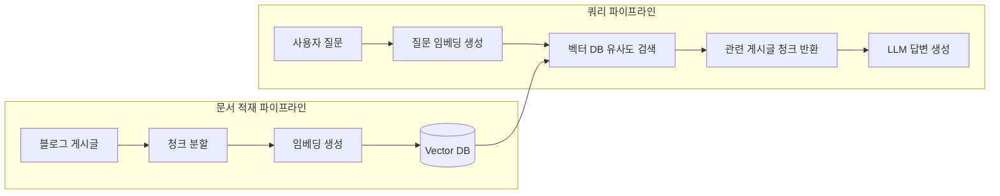

먼저 말씀드리면 저는 이전에도 개발 블로그를 운영한 적이 있습니다. 그때도 여러가지 문제점이 있었지만, 제가 느꼈던 문제점 중 하나는 분명 개발 블로그를 작성하고 있는데도 제 지식이 늘어난다는 느낌은 받지 못했다는 것입니다.

이상하지 않나요? 블로그 글은 늘어나는데 지식은 늘어나고 있지 않다니요. 물론 게시글의 질이 낮아서, 혹은 제가 블로그를 주기적으로 정독하지 않아서 이런 문제가 발생할 수도 있었을 겁니다. 하지만 제가 내린 결론은 게시글 단위의 지식을 쉽게 참조할 수 있는 무언가가 없다는 점이었습니다.

## 지식의 감옥, 게시글

분명 게시글은 지식의 저장물입니다. 하지만 게시글은 지식을 알아서 제공해주지 않습니다. 원하는 지식이 포함된 글을 **1. 찾아서 2. 읽고 3. 이해하는** 과정이 필요하죠. 문제는 인간은 망각의 동물이고 기존의 검색 시스템은 내 의도를 이해하지 못한다는 점입니다. 내가 참조하고 싶은 지식이, 내가 참조하고 싶을 때, 검색에 걸릴 만한 특정 단어로 적혀있을지는 알 수가 없죠. 때문에 블로그에 게시글을 쓰고 나면 지식은 게시글에 갇히게 됩니다.

그렇다면 어떻게 하면 이 문제를 해결할 수 있을까요? 내가 원하는 개념을 이해하고 이를 알아서 가져와주는 무언가가 있다면 가능하지 않을까요?

## 그래서 RAG

RAG(Retrieval-Augmented Generation)란, 질문이 들어오면 관련된 문서를 먼저 검색해서 가져온 뒤, 그 내용을 바탕으로 AI가 답변을 생성하는 방식입니다.

핵심은 검색 방식에 있습니다. 기존 키워드 검색은 내가 찾고 싶은 단어를 정확히 알아야 하지만, RAG는 텍스트를 의미 단위의 벡터로 변환해 조회하기 때문에 <u>단어가 아니라 의도로 검색</u>할 수 있습니다. 즉, 이를 활용하면 블로그에 쌓인 글들이 단순한 아카이브가 아니라 나와 대화할 수 있는 지식 베이스가 되는 겁니다.

## 어떻게 만들까?

전체 구조는 크게 두 단계로 나뉩니다. 게시글을 벡터로 변환해 저장하는 문서 적재 파이프라인과, 질문을 받아 관련 내용을 찾고 답변을 생성하는 쿼리 파이프라인입니다.



### 문서 적재 파이프라인

문서 적재 파이프라인에서는 게시글을 청크 단위로 분할한 뒤, 임베딩 모델을 통해 벡터로 변환하고 Vector DB에 저장합니다.

저는 이 Vector DB를 사용하기 위해 Supabase를 선택했는데요. 별도의 벡터 DB를 운영하는 것보다 RAG 서비스 자체에 집중하고 싶었고, Supabase는 pgvector를 지원하기 때문에 추가 인프라 없이 바로 시작할 수 있었거든요. 그리고 무료기도 했습니다.

테이블은 아래처럼 정의했습니다. 청크의 내용과 임베딩 벡터를 함께 저장하고, slug로 원본 게시글을 참조할 수 있도록 했죠.

```sql
create table chunks (
  id bigint primary key generated always as identity,
  slug text not null,
  content text not null,
  embedding vector(768),
  tags text[],
  category text,
  content_type text
);
```

또한 질문이 들어왔을 때 유사한 청크를 검색할 수 있는 함수도 정의했습니다. 코사인 유사도를 기준으로 threshold 이상인 청크만 가져오고, 최대 개수도 제한할 수 있도록 했어요.

```sql
create or replace function match_chunks(
  query_embedding vector(768),
  match_count int default 5,
  match_threshold float default 0.5
)
returns table (
  id uuid,
  content text,
  slug text,
  tags text[],
  category text,
  content_type text,
  similarity float
)
language plpgsql
as $$
begin
  return query
  select
    chunks.id,
    chunks.content,
    chunks.slug,
    chunks.tags,
    chunks.category,
    chunks.content_type,
    1 - (chunks.embedding <=> query_embedding) as similarity
  from chunks
  where 1 - (chunks.embedding <=> query_embedding) > match_threshold
  order by chunks.embedding <=> query_embedding
  limit match_count;
end;
$$;
```

위 함수는 SQL 단에서 정의된 RPC 함수인데요. 이를 통해 SQL에 직접 접근하지 않고도 벡터 검색을 호출할 수 있습니다. 클라이언트는 임베딩된 질문 벡터만 넘겨주면 되고, 유사도 계산은 DB 안에서 처리됩니다.

이제 DB 쪽이 완료되었으니 클라이언트 단에서 문서를 임베딩해서 저장을 요청하는 코드도 필요하겠죠. 저는 다양한 임베딩 모델을 유연하게 사용하고 싶어서 OpenRouter를 활용했고, Vercel의 AI SDK를 통해 간단하게 구현했습니다.

```ts
const { embedding } = await embed({
  model: openrouter.textEmbeddingModel("qwen/qwen3-embedding-8b", { extraBody: { dimensions: 768 } }),
  value: content,
});

await supabase.from("chunks").insert({
  slug, content, embedding, tags, category, content_type: contentType,
});
```

임베딩 모델로는 qwen/qwen3-embedding-8b를 선택했습니다. OpenAI의 text-embedding-3-large나 Google의 Gemini Embedding도 고려했지만, 아무래도 오픈소스 모델이라 저렴하게 사용할 수 있다는 점이 가장 컸습니다. 거기다 다른 모델 대비 한국어 지원이 우수하고, 임베딩 차원을 유연하게 조정할 수 있으며, 필요하다면 로컬에서도 직접 서빙할 수 있다는 점도 물론 매력적이었고요.

### 쿼리 파이프라인

## 잘 되고 있는걸까?

평가가 필요한 이유

테스트셋 구성방법

REGAS 지표 4개 소개

## Chunking 전략 실험

청킹 전략 별 평가 실험 결과와 결론

## 마무리 - 아직 남은 문제

##
