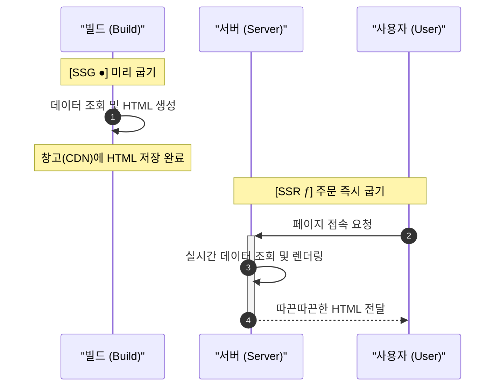
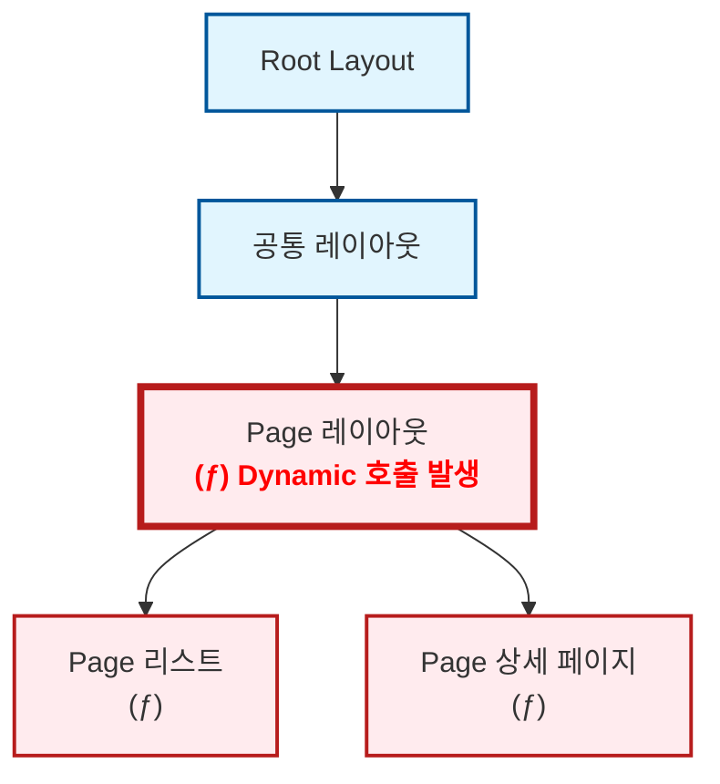

블로그 개발을 처음 시작할 때만 해도 Next.js에 대해 제대로 알지 못했습니다. "일단 굴러가게 만들고, 틀린 건 나중에 고치면 되지"라는 가벼운 마음으로 코드를 쌓아 올렸죠. 그렇게 제 블로그는 어느덧 (제 의도와는 다르게) 아주 𝓓𝔂𝓷𝓪𝓶𝓲𝓬한 사이트가 되어 있었습니다.

물론 믿는 구석은 있었습니다. Next.js에는 [`generateStaticParams`](https://nextjs.org/docs/app/api-reference/functions/generate-static-params)라는 마법 같은 함수가 있으니까요. "나중에 이거 한 줄만 적어주면 전부 SSG로 변하겠지"라며 근거 없는 자신감으로 작업을 미뤄왔습니다.

그리고 드디어 결전의 날, 야심 차게 `generateStaticParams` 함수를 작성하고 빌드 명령어를 입력했습니다. 결과는...

\[사진]

**⁽⁽◝( ˙ ꒳ ˙ )◜⁾⁾** **짜잔! 아무 일도 일어나지 않았습니다.**

터미널을 가득 채운 동그란 아이콘을 기대했지만, 제 눈앞에 나타난 건 여전히 서슬 퍼런 다이나믹 기호 뿐이었습니다. 분명 공식 문서대로 구현했는데, 왜 제 블로그는 정적 생성을 거부하는 걸까요? 오늘은 그 삽질의 기록을 공유합니다.

## Next.js의 정적 판정 이해하기

원인을 파악하려면 Next.js가 왜 상세 페이지를 동적 경로로 구분했는지 찾아봐야겠죠. 그러기 위해서는 먼저 Next.js에서 말하는 정적(Static)과 동적(Dynamic)의 개념을 잡고 갈 필요가 있습니다.



정적은 다른 말로 SSG(Static Site Generation), 그리고 동적이라고 SSR(Server Side Rendering)로 말할 수 있습니다. 그리고 이 둘의 차이는 페이지를 언제 생성할 것이냐에 따라 달라집니다.&#x20;

SSG는 페이지를 빌드 시에 생성합니다. 때문에 SSG는 모든 데이터가 빌드할 때 고정되야하는 데이터로 구성되어야하며, 즉 정적(Static)입니다.&#x20;

반대로 SSR은 사용자가 요청 시 서버에서 실시간으로 페이지를 만들어서 사용자에게 전달하기 때문에 그때그때 바뀌는 데이터를 참조할 수 있습니다. 즉, 동적(Dynamic)입니다.

즉, Next.js에서 이 페이지는 정적 페이지이고, 이 페이지는 동적 페이지로 빌드되었다라는 표시는 이 페이지를 '언제 생성할 것이냐'를 구분했다는 의미입니다.

```ts
export async function generateStaticParams() {
	const slugs = await getPostSlugs();

	return slugs.map((slug) => ({ slug }));
}
```

`generateStaticParams` 함수는 원래라면 운영 시에 실시간으로 바뀌는 동적 경로(`/[slug]`)에 대해서 URL 리스트를 제출하여 이를 정적 경로로 동작하게 만들어주는 역할을 합니다. 즉, 이런이런 URL이 있으니 이 URL들은 미리 정적으로 생성해줘 라고 요청하는거죠.

하지만 여기서 알아둬야하는 사실이 있습니다. **명단을 제출했다고 해서 Next.js가 무조건 정적 페이지(SSG)로 만들어주는 건 아니라는 사실**입니다.

Next.js는 각 라우트를 트리 형태로 관리합니다. 최상위 레이아웃부터 상세 페이지들까지 하나의 트리를 구성합니다. 그런데 이 트리 중 어느 한 곳에서라도 동적 요소가 발견된다면, Next.js는 그 지점부터 아래로 이어지는 모든 라우트를 동적 페이지로 판정해 버립니다.



그렇기 때문에 상세 페이지에도, 상세 페이지까지 오는 길에도 동적 요소가 없어야만 비로소 상세 페이지가 정적 페이지로 빌드될 수 있습니다.

그렇다면 여기서 말하는 동적 요소(Dynamic Functions)란 대체 뭘까요? 아까 말했듯, 동적 요소는 운영 중에 실시간으로 바뀔 수 있는 요소를 말합니다. 대표적으로 쿠키,&#x20;
