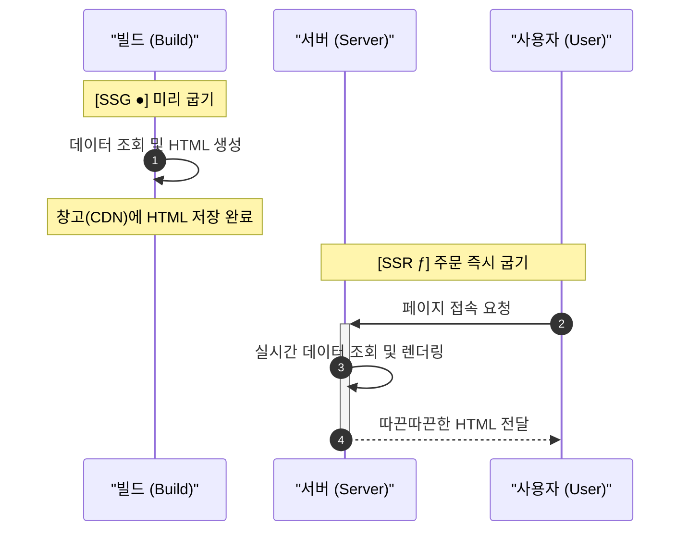
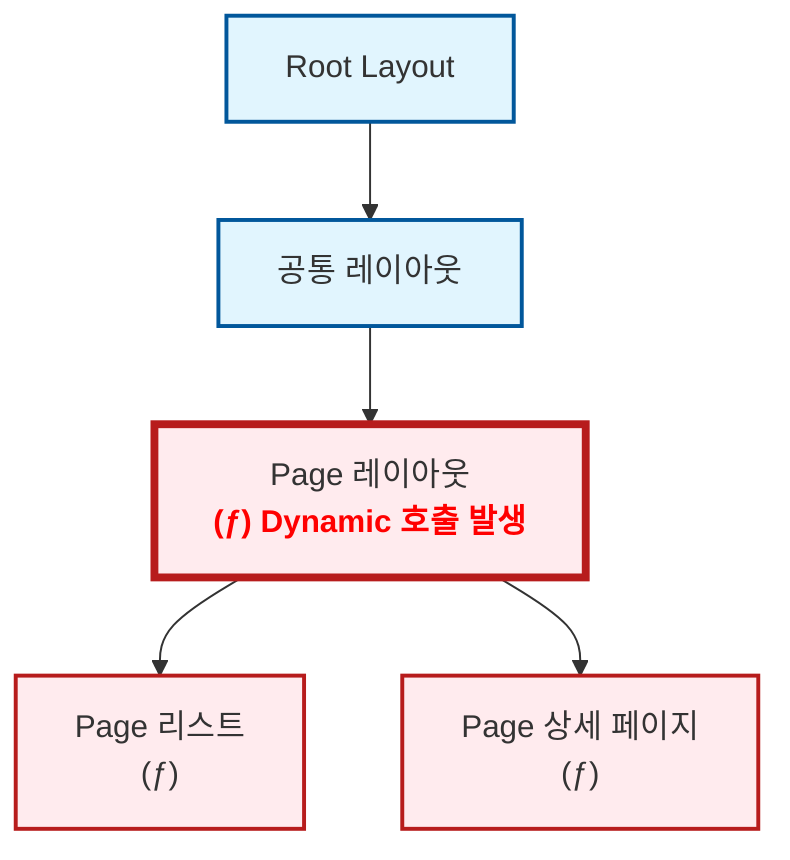

블로그 개발을 처음 시작할 때만 해도 Next.js에 대해 제대로 알지 못했습니다. "일단 굴러가게 만들고, 틀린 건 나중에 고치면 되지"라는 가벼운 마음으로 코드를 쌓아 올렸죠. 그렇게 제 블로그는 어느덧 (제 의도와는 다르게) 아주 𝓓𝔂𝓷𝓪𝓶𝓲𝓬한 사이트가 되어 있었습니다.

물론 믿는 구석은 있었습니다. Next.js에는 [`generateStaticParams`](https://nextjs.org/docs/app/api-reference/functions/generate-static-params)라는 마법 같은 함수가 있으니까요. "나중에 이거 한 줄만 적어주면 전부 SSG로 변하겠지"라며 근거 없는 자신감으로 작업을 미뤄왔습니다.

그리고 드디어 결전의 날, 야심 차게 `generateStaticParams` 함수를 작성하고 빌드 명령어를 입력했습니다. 결과는...

\[사진]

**⁽⁽◝( ˙ ꒳ ˙ )◜⁾⁾** **짜잔! 아무 일도 일어나지 않았습니다.**

터미널을 가득 채운 동그란 아이콘을 기대했지만, 제 눈앞에 나타난 건 여전히 서슬 퍼런 다이나믹 기호 뿐이었습니다. 분명 공식 문서대로 구현했는데, 왜 제 블로그는 정적 생성을 거부하는 걸까요? 오늘은 그 삽질의 기록을 공유합니다.

## 정적과 동적 이해하기

원인을 파악하려면 Next.js가 왜 상세 페이지를 동적 경로로 구분했는지 찾아봐야겠죠. 그러기 위해서는 먼저 Next.js에서 말하는 **정적(Static)**&#xACFC; **동적(Dynamic)**&#xC758; 개념을 잡고 갈 필요가 있습니다.



Next.js에서 말하는 **정적**은 다른 말로 <u>SSG(Static Site Generation)</u>, 그리고 **동적**은 <u>SSR(Server Side Rendering)</u>로 말할 수 있습니다. CSR(Client Side Rendering)과는 다소 다른 개념인 것 같은데 어떻게 이런 구분이 가능한걸까요? 그건 바로 이 두 방식의 페이지의 생성 시점이 다르기 때문입니다.

SSG는 페이지를 <u>빌드 시에 생성</u>합니다. 때문에 SSG는 모든 데이터가 빌드할 때 고정되야하는 데이터로 구성되어야하며, 즉 **정적(Static)**&#xC785;니다.&#x20;

반대로 SSR은 사용자가 요청 시 서버에서 <u>실시간으로 페이지를 만들어서 사용자에게 전달</u>하기 때문에 그때그때 바뀌는 데이터를 참조할 수 있습니다. 즉, **동적(Dynamic)**&#xC785;니다.

즉, Next.js에서 이 페이지는 정적 페이지이고, 이 페이지는 동적 페이지로 빌드되었다라는 표시는 이 페이지를 '언제 생성할 것이냐'를 구분했다는 의미입니다.

## Next.js의 정적 판정

```ts
export async function generateStaticParams() {
	const slugs = await getPostSlugs();

	return slugs.map((slug) => ({ slug }));
}
```

자, 그럼 다시 돌아와봅시다. `generateStaticParams` 함수는 원래라면 운영 시에 실시간으로 바뀌는 **동적 경로(`/[slug]`)**&#xC5D0; 대해서 URL 리스트를 제출하여 이를 **정적 경로**로 동작하게 만들어주는 역할을 합니다. 즉, 이런이런 URL이 있으니 이 URL들은 미리 정적으로 생성해줘 라고 요청하는거죠.

하지만 여기서 알아둬야 할 사실이 있습니다. `generateStaticParams`로 URL 목록을 제출했다고 해서 Next.js가 그 페이지를 무조건 SSG로 만들어주는 것은 아닙니다. 해당 라우트가 빌드 시점에 결정 가능한 데이터만 사용해야 비로소 정적으로 생성됩니다.

Next.js는 라우트 세그먼트를 따라 정적 렌더링 가능 여부를 판단합니다. 이 과정에서 `cookies()`, `headers()`, `draftMode()`, 페이지의 `searchParams` prop처럼 요청 시점에만 알 수 있는 [Dynamic API](https://nextjs-ko.org/docs/app/building-your-application/rendering/server-components#dynamic-functions)가 끼어들면, 그 경로는 더 이상 순수한 정적 경로로 유지되기 어려워집니다.



## 동적 요소 제거하기

이제 원인을 알았으니 다시 코드를 보러 갔습니다. 그리고 보았습니다. 수많은 동적 요소들이 상세 페이지를 렌더링하기 위해 애쓰고 있는 것을요. 이러니 `generateStaticParams` 조금 적었다고 SSG로 렌더링이 될리가 없었습니다.

### reader 관심사 분리하기

가장 먼저 칼을 댄 곳은 데이터를 읽어오는 핵심 로직인 `reader`였습니다. 제 블로그는 Keystatic을 사용해 게시글을 관리하는데, 기존의 `reader` 함수는 단순한 데이터 조회를 넘어 너무 많은 '실시간성' 일을 하고 있었습니다.

<Tabs>
  <Tab label="Before">
    ```ts
    import { createReader } from "@keystatic/core/reader";
    import { createGitHubReader } from "@keystatic/core/reader/github";
    import { cookies, draftMode } from "next/headers";
    import keystaticConfig from "@/root/keystatic.config";
    import { isRemotePreviewEnabled } from "./runtime";

    export const reader = async () => {
    	let isDraftModeEnabled = false;

    	try {
    		const draftModeStore = await draftMode();

    		isDraftModeEnabled = draftModeStore.isEnabled;
    	} catch (error) {
    		console.error(error);
    	}

    	if (isRemotePreviewEnabled() && isDraftModeEnabled) {
    		const cookieStore = await cookies();
    		const branch = cookieStore.get("ks-branch")?.value;

    		if (branch) {
    			return createGitHubReader(keystaticConfig, {
    				repo: `${process.env.NEXT_PUBLIC_KEYSTATIC_OWNER}/${process.env.NEXT_PUBLIC_KEYSTATIC_REPO}`,
    				ref: branch,
    				token: cookieStore.get("keystatic-gh-access-token")?.value,
    			});
    		}
    	}

    	return createReader(process.cwd(), keystaticConfig);
    };

    ```
  </Tab>

  <Tab label="After">
    ```ts
    import { createReader } from "@keystatic/core/reader";
    import { createGitHubReader } from "@keystatic/core/reader/github";
    import type { ContentAccessOptions } from "@/libs/contents/types";
    import keystaticConfig from "@/root/keystatic.config";
    import { shouldUseRemotePreview } from "./runtime";

    export const reader = async (options: ContentAccessOptions = {}) => {
    	const preview = options.preview;

    	if (preview && shouldUseRemotePreview(options)) {
    		return createGitHubReader(keystaticConfig, {
    			repo: `${process.env.NEXT_PUBLIC_KEYSTATIC_OWNER}/${process.env.NEXT_PUBLIC_KEYSTATIC_REPO}`,
    			ref: preview.branch,
    			token: preview.token,
    		});
    	}

    	return createReader(process.cwd(), keystaticConfig);
    };
    ```
  </Tab>
</Tabs>

기존 `reader`는 함수 내부에서 직접 `cookies()`와 `draftMode()`를 호출하고 있었습니다. 이 방식의 치명적인 단점은, 단순히 글 목록을 가져오고 싶어서 이 함수를 호출하기만 해도 해당 페이지 전체가 동적 렌더링(`ƒ`)으로 변해버린다는 것이었습니다. `reader`는 데이터를 읽는 함수인 척하면서, 사실상 "저 지금 요청 상태 같이 보고 있습니다"라고 광고하고 있었던 셈입니다. 이러니 공개 라우트까지 정적으로 굳질 못했던 것이죠.

그래서 `reader` 안에서 직접 동적 요소를 읽는 방식은 버리고, preview에 필요한 정보만 바깥에서 넘겨받도록 바꿨습니다. 그제서야 `reader`는 정말로 '읽기만 하는 함수'가 되었습니다.&#x20;

이제 빌드 시점에는 아무 옵션 없이 정적으로 글을 읽고, 정말 preview가 필요한 순간에만 바깥에서 관련 정보를 넘겨주면 됩니다. 덕분에 적어도 데이터 읽는 층에서부터 사이트를 𝓓𝔂𝓷𝓪𝓶𝓲𝓬하게 만드는 일은 막을 수 있었습니다.

### searchParams 유배 보내기

그 다음으로 끌어낸 것은 상세 페이지에 눌러앉아 있던 searchParams였습니다.

제 블로그는 카테고리 필터를 쿼리스트링으로 유지하는데, 문제는 이 상태를 상세 페이지에서도 끝까지 끌고 갔다는 점이었습니다. 뒤로 가기, 이전 글, 다음 글까지 전부 현재 쿼리를 기준으로 움직이다 보니, 정작 slug만 있으면 되어야 할 상세 페이지가 요청의 맥락까지 같이 책임지고 있었던 것입니다.

원래 구조는 이랬습니다. 상세 페이지가 서버에서 searchParams를 직접 받고, 그 값으로 이전 글과 다음 글 목록까지 계산하고 있었습니다.

```tsx
export default async function BlogPost({ params, searchParams }: BlogPageProps) {
  const { slug } = await params;
  const query = await searchParams;

  const post = await getPost(slug);
  const postList = await getPostList(query);

  const currentIndex = postList.list.findIndex(
    (post) => sanitizeSlug(post.slug) === sanitizeSlug(slug),
  );

  const nextPost = currentIndex + 1 < postList.total ? postList.list[currentIndex + 1] : null;
  const prevPost = currentIndex - 1 >= 0 ? postList.list[currentIndex - 1] : null;

  return (
    <nav className="flex" aria-label="이전 다음 글">
      {prevPost && (
        <Link href={{ pathname: `/posts/${prevPost.slug}`, query }}>
          이전 글
        </Link>
      )}
      {nextPost && (
        <Link href={{ pathname: `/posts/${nextPost.slug}`, query }}>
          다음 글
        </Link>
      )}
    </nav>
  );
}

```

이 상태에서는 상세 페이지가 글만 렌더링하는 페이지가 아니라, "지금 사용자가 어떤 카테고리 필터를 보고 있었는가"까지 알고 있어야 하는 페이지가 됩니다. 한마디로, 상세 페이지가 너무 많은 걸 알고 있었습니다.

그래서 방향을 바꿨습니다. 상세 페이지는 글 내용과 기본 목록만 정적으로 들고 있게 두고, 현재 쿼리를 읽는 일은 아예 클라이언트 내비게이션으로 분리한 것입니다.

```tsx
export default async function BlogPost({ params }: BlogPageProps) {
  const { slug } = await params;

  const post = await getPost(slug);
  const postList = await getPostList();

  return (
    <PostDetailPageContent
      post={post}
      postList={postList.list}
    />
  );
}
```

대신 이전 글, 다음 글, 돌아가기 링크처럼 정말로 현재 쿼리가 필요한 부분만 클라이언트 컴포넌트로 따로 빼냈습니다.

```tsx
"use client";

export const PostDetailNavigationClient = ({ currentSlug, items }: PostDetailNavigationProps) => {
  const searchParams = useSearchParams();
  const category = searchParams.get("category");

  const filteredItems = category
    ? items.filter((item) => item.category.slug === category)
    : items;

  const currentIndex = filteredItems.findIndex(
    (item) => sanitizeSlug(item.slug) === sanitizeSlug(currentSlug),
  );

  const prevPost = currentIndex > 0 ? filteredItems[currentIndex - 1] : null;
  const nextPost =
    currentIndex >= 0 && currentIndex + 1 < filteredItems.length
      ? filteredItems[currentIndex + 1]
      : null;

  return (
    <nav aria-label="상세 페이지 이동" className="flex flex-col gap-6">
      <div className="hidden md:block">
        <QueryPreservingBackLink pathname="/posts" />
      </div>

      <div className="flex">
        {prevPost && (
          <Link href={getHrefWithCurrentQuery(`/posts/${prevPost.slug}`, searchParams)}>
            이전 글
          </Link>
        )}
        {nextPost && (
          <Link href={getHrefWithCurrentQuery(`/posts/${nextPost.slug}`, searchParams)}>
            다음 글
          </Link>
        )}
      </div>
    </nav>
  );
};
```

여기서 끝이 아니었습니다. useSearchParams()를 쓰는 컴포넌트를 그냥 꽂아 넣기만 하면, 정적으로 렌더링하고 싶은 경로에서도 그 경계가 흐려질 수 있습니다. 그래서 저는 이 내비게이션을 Suspense로 한 번 더 감쌌습니다.

```tsx
export const PostDetailNavigation = ({ currentSlug, items, prevPost, nextPost }: PostDetailNavigationProps) => {
  return (
    <Suspense
      fallback={
        <>
          <hr className="border-slate-200 dark:border-slate-800" />
          <nav aria-label="상세 페이지 이동" className="flex flex-col gap-6">
            <div className="hidden md:block">
              <Link href="/posts" className="flex items-center gap-1 text-slate-500 hover:underline dark:text-slate-400">
                <ArrowLeft size={16} />
                <span>돌아가기</span>
              </Link>
            </div>

            <div className="flex">
              {prevPost && <Link href={`/posts/${prevPost.slug}`}>이전 글</Link>}
              {nextPost && <Link href={`/posts/${nextPost.slug}`}>다음 글</Link>}
            </div>
          </nav>
        </>
      }
    >
      <PostDetailNavigationClient currentSlug={currentSlug} items={items} />
    </Suspense>
  );
};
```


## 관리자 검증 로직 렌더 경로 밖으로 밀어내기

`searchParams`까지 유배 보내고 나니 끝난 줄 알았습니다만 여전히 빌드 결과는 𝓓𝔂𝓷𝓪𝓶𝓲𝓬했습니다. 할만큼 한 것 같은데 뭐가 문제인가 싶어서, 공개 페이지가 글만 얌전히 렌더링하면 될 일인데, 은근슬쩍 "지금 이 사용자가 관리자냐"까지 같이 판단하고 있었던 것입니다.

기존 구조에서는 getAdminContext()를 레이아웃과 상세 페이지에서 직접 호출하고 있었습니다. 문제는 이 순간부터였습니다. 공개 페이지가 단순히 글을 보여주는 경로가 아니라, 현재 요청을 보고 관리자 여부까지 판별하는 경로가 되어버린 것이죠. 글을 보여주러 왔더니 갑자기 신분 조회까지 하고 있었던 셈입니다.

그래서 이 판단을 공개 렌더 경로 밖으로 밀어냈습니다. 공개 페이지는 일단 정적으로 렌더링하고, 관리자 여부는 별도의 API에서 확인한 뒤 클라이언트에서 뒤늦게 주입하도록 바꾼 것입니다. 덕분에 관리자 링크는 필요할 때만 붙고, 적어도 공개 페이지의 기본 렌더 경로만큼은 "글을 보여주는 일"에만 집중할 수 있게 되었습니다.
