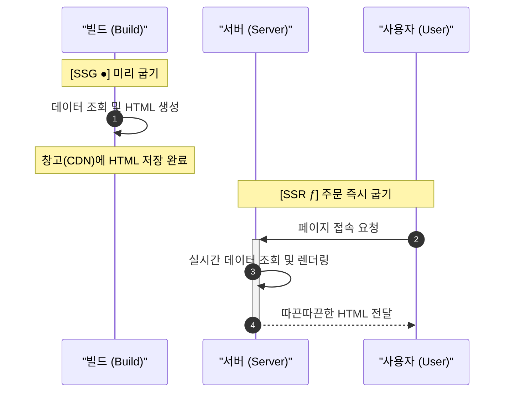
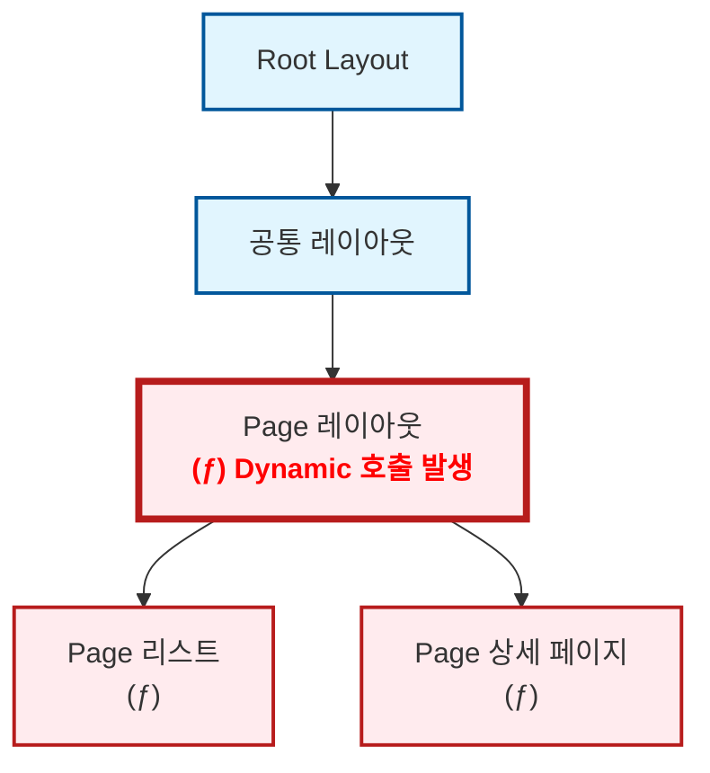

블로그 개발을 처음 시작할 때만 해도 Next.js에 대해 제대로 알지 못했습니다. "일단 굴러가게 만들고, 틀린 건 나중에 고치면 되지"라는 가벼운 마음으로 코드를 쌓아 올렸죠. 그렇게 제 블로그는 어느덧 (제 의도와는 다르게) 아주 𝓓𝔂𝓷𝓪𝓶𝓲𝓬한 사이트가 되어 있었습니다.

물론 믿는 구석은 있었습니다. Next.js에는 [`generateStaticParams`](https://nextjs.org/docs/app/api-reference/functions/generate-static-params)라는 마법 같은 함수가 있으니까요. "나중에 이거 한 줄만 적어주면 전부 SSG로 변하겠지"라며 근거 없는 자신감으로 작업을 미뤄왔습니다.

그리고 드디어 결전의 날, 야심 차게 `generateStaticParams` 함수를 작성하고 빌드 명령어를 입력했습니다. 결과는...

\[사진]

**⁽⁽◝( ˙ ꒳ ˙ )◜⁾⁾** **짜잔! 아무 일도 일어나지 않았습니다.**

터미널을 가득 채운 동그란 아이콘을 기대했지만, 제 눈앞에 나타난 건 여전히 서슬 퍼런 다이나믹 기호 뿐이었습니다. 분명 공식 문서대로 구현했는데, 왜 제 블로그는 정적 생성을 거부하는 걸까요? 오늘은 그 삽질의 기록을 공유합니다.

## 정적과 동적 이해하기

원인을 파악하려면 Next.js가 왜 상세 페이지를 동적 경로로 구분했는지 찾아봐야겠죠. 그러기 위해서는 먼저 Next.js에서 말하는 **정적(Static)**&#xACFC; **동적(Dynamic)**&#xC758; 개념을 잡고 갈 필요가 있습니다.



Next.js에서 말하는 **정적**은 다른 말로 <u>SSG(Static Site Generation)</u>, 그리고 **동적**은 <u>SSR(Server Side Rendering)</u>로 말할 수 있습니다. CSR(Client Side Rendering)과는 다소 다른 개념인 것 같은데 어떻게 이런 구분이 가능한걸까요? 그건 바로 이 두 방식의 페이지의 생성 시점이 다르기 때문입니다.

SSG는 페이지를 <u>빌드 시에 생성</u>합니다. 때문에 SSG는 모든 데이터가 빌드할 때 고정되야하는 데이터로 구성되어야하며, 즉 **정적(Static)**&#xC785;니다.&#x20;

반대로 SSR은 사용자가 요청 시 서버에서 <u>실시간으로 페이지를 만들어서 사용자에게 전달</u>하기 때문에 그때그때 바뀌는 데이터를 참조할 수 있습니다. 즉, **동적(Dynamic)**&#xC785;니다.

즉, Next.js에서 이 페이지는 정적 페이지이고, 이 페이지는 동적 페이지로 빌드되었다라는 표시는 이 페이지를 '언제 생성할 것이냐'를 구분했다는 의미입니다.

## Next.js의 정적 판정

```ts
export async function generateStaticParams() {
	const slugs = await getPostSlugs();

	return slugs.map((slug) => ({ slug }));
}
```

자, 그럼 다시 돌아와봅시다. `generateStaticParams` 함수는 원래라면 운영 시에 실시간으로 바뀌는 **동적 경로(`/[slug]`)**&#xC5D0; 대해서 URL 리스트를 제출하여 이를 **정적 경로**로 동작하게 만들어주는 역할을 합니다. 즉, 이런이런 URL이 있으니 이 URL들은 미리 정적으로 생성해줘 라고 요청하는거죠.

하지만 여기서 알아둬야하는 사실이 있습니다. **명단을 제출했다고 해서 Next.js가 무조건 정적 페이지(SSG)로 만들어주는 건 아니라는 사실**입니다.

Next.js는 각 라우트를 트리 형태로 관리합니다. 최상위 레이아웃부터 상세 페이지들까지 하나의 트리를 구성합니다. 그런데 <u>이 트리 중 어느 한 곳에서라도 동적 요소가 발견된다면, Next.js는 그 지점부터 아래로 이어지는 모든 라우트를 동적 페이지로 판정</u>해 버립니다.



그렇기 때문에 상세 페이지에도, 상세 페이지까지 오는 길에도 동적 요소가 없어야만 비로소 상세 페이지가 정적 페이지로 빌드될 수 있습니다.

그렇다면 여기서 말하는 동적 요소(Dynamic Functions)란 대체 뭘까요? 아까 말했듯, 동적 요소는 운영 중에 실시간으로 바뀔 수 있는 요소를 말합니다. 대표적으로 [cookies, headers와 같은 함수를사용하거나 searchParams 같은 prop](https://nextjs-ko.org/docs/app/building-your-application/rendering/server-components#dynamic-functions)을 사용하는 경우가 있습니다.

## 동적 요소 제거하기

그렇게 원인을 알았으니 다시 코드를 보러 갔습니다. 그리고 보았습니다. 수많은 동적 요소들이 상세 페이지를 렌더링하기 위해 애쓰고 있는 것을요. 이러니 `generateStaticParams` 조금 적었다고 SSG로 렌더링이 될리가 없었습니다.

### 관심사 분리하기

가장 먼저 칼을 댄 곳은 데이터를 읽어오는 핵심 로직인 `reader`였습니다. 제 블로그는 Keystatic을 사용해 게시글을 관리하는데, 기존의 `reader` 함수는 단순한 데이터 조회를 넘어 너무 많은 '실시간성' 일을 하고 있었습니다.

<Tabs>
  <Tab label="Before">
    ```ts
    import { createReader } from "@keystatic/core/reader";
    import { createGitHubReader } from "@keystatic/core/reader/github";
    import { cookies, draftMode } from "next/headers";
    import keystaticConfig from "@/root/keystatic.config";
    import { isRemotePreviewEnabled } from "./runtime";

    export const reader = async () => {
    	let isDraftModeEnabled = false;

    	try {
    		const draftModeStore = await draftMode();

    		isDraftModeEnabled = draftModeStore.isEnabled;
    	} catch (error) {
    		console.error(error);
    	}

    	if (isRemotePreviewEnabled() && isDraftModeEnabled) {
    		const cookieStore = await cookies();
    		const branch = cookieStore.get("ks-branch")?.value;

    		if (branch) {
    			return createGitHubReader(keystaticConfig, {
    				repo: `${process.env.NEXT_PUBLIC_KEYSTATIC_OWNER}/${process.env.NEXT_PUBLIC_KEYSTATIC_REPO}`,
    				ref: branch,
    				token: cookieStore.get("keystatic-gh-access-token")?.value,
    			});
    		}
    	}

    	return createReader(process.cwd(), keystaticConfig);
    };

    ```
  </Tab>

  <Tab label="After">
    ```ts
    import { createReader } from "@keystatic/core/reader";
    import { createGitHubReader } from "@keystatic/core/reader/github";
    import type { ContentAccessOptions } from "@/libs/contents/types";
    import keystaticConfig from "@/root/keystatic.config";
    import { shouldUseRemotePreview } from "./runtime";

    export const reader = async (options: ContentAccessOptions = {}) => {
    	const preview = options.preview;

    	if (preview && shouldUseRemotePreview(options)) {
    		return createGitHubReader(keystaticConfig, {
    			repo: `${process.env.NEXT_PUBLIC_KEYSTATIC_OWNER}/${process.env.NEXT_PUBLIC_KEYSTATIC_REPO}`,
    			ref: preview.branch,
    			token: preview.token,
    		});
    	}

    	return createReader(process.cwd(), keystaticConfig);
    };
    ```
  </Tab>
</Tabs>

기존 `reader`는 함수 내부에서 직접 `cookies()`와 `draftMode()`를 호출하고 있었습니다. 이 방식의 치명적인 단점은, 단순히 글 목록을 가져오고 싶어서 이 함수를 호출하기만 해도 해당 페이지 전체가 동적 렌더링(`ƒ`)으로 변해버린다는 것이었습니다. `reader`가 "난 지금 쿠키를 보고 있어!"라고 선언해버렸기 때문에, reader를 사용하는 모든 라우트와 하위 노드들까지 전부 동적으로 오염되는 구조였습니다.

이를 해결하기 위해 `reader` 내부에서 직접 동적 요소를 참조하는 대신, 필요한 정보(preview 정보 등)를 파라미터로 전달받도록 수정했습니다. 이렇게 하면 `reader`는 오직 '데이터를 읽어온다'는 본연의 역할에만 집중하게 됩니다. 빌드 타임에는 아무 옵션 없이 호출하여 정적으로 글을 가져오고, 미리보기 모드가 필요한 런타임에만 외부에서 쿠키 정보를 주입해주면 됩니다. 덕분에 데이터 레이어에서 발생하던 '동적 오염'을 원천 봉쇄할 수 있었습니다.

### searchParams 유배 보내기

그 다음으로 한 일은 바로 상세 페이지에 있던 `searchParams`를 분리하는 일이었습니다. 제 블로그에는 카테고리나 태그를 url에 `searchParams`로 제공하여 필터링을 하는데, 뒤로 가기나 이전 글, 다음 글 시에도 이 카테고리를 유지하려 하다보니 정적이어야하는 상세 페이지에서도 이 값을 참조하는 문제가 발생한 것이었습니다.

<Tabs>
  <Tab label="Before">
    ```ts title="app/posts/[slug]/page.tsx"
    export default async function BlogPost({ params, searchParams }: BlogPageProps) {
        const { slug } = await params;
    	// @line highlight
        const query = await searchParams;
        const postList = await getPostList(query); 
    	// @line highlight end

        return (
            /* ... 생략 ... */
            <Link href={{ pathname: `/posts/${prevPost.slug}`, query }}>이전 글</Link>
        );
    }
    ```
  </Tab>

  <Tab label="After">
    ```ts
    // 1. 서버 컴포넌트
    export default async function BlogPost({ params }: BlogPageProps) {
        const { slug } = await params;
        const post = await getPost(slug);
        const postList = await getPostList(); // 쿼리 없이 전체 리스트를 가져옴

        // 상세 페이지의 뼈대만 정적으로 렌더링
        return <PostDetailPageContent post={post} postList={postList.list} />;
    }

    // 2. 클라이언트 컴포넌트 (PostDetailNavigation): 동적 처리를 전담
    'use client';
    export function PostDetailNavigation({ items }) {
    	// @line highlight
        const searchParams = useSearchParams();
        const category = searchParams.get('category');

        // 사용자가 보고 있는 카테고리에 맞춰 이전/다음 글 링크를 클라이언트에서 계산
        return <Link href={`/posts/${prev.slug}?category=${category}`}>이전 글</Link>;
    }
    ```
  </Tab>
</Tabs>

이를 해결하기 위해 상세 페이지는 오직 '글 내용'에만 집중하게 하고, 유동적인 필터 정보(`searchParams`)는 클라이언트 컴포넌트로 격리했습니다.

## 관리자 로직 분리하기

