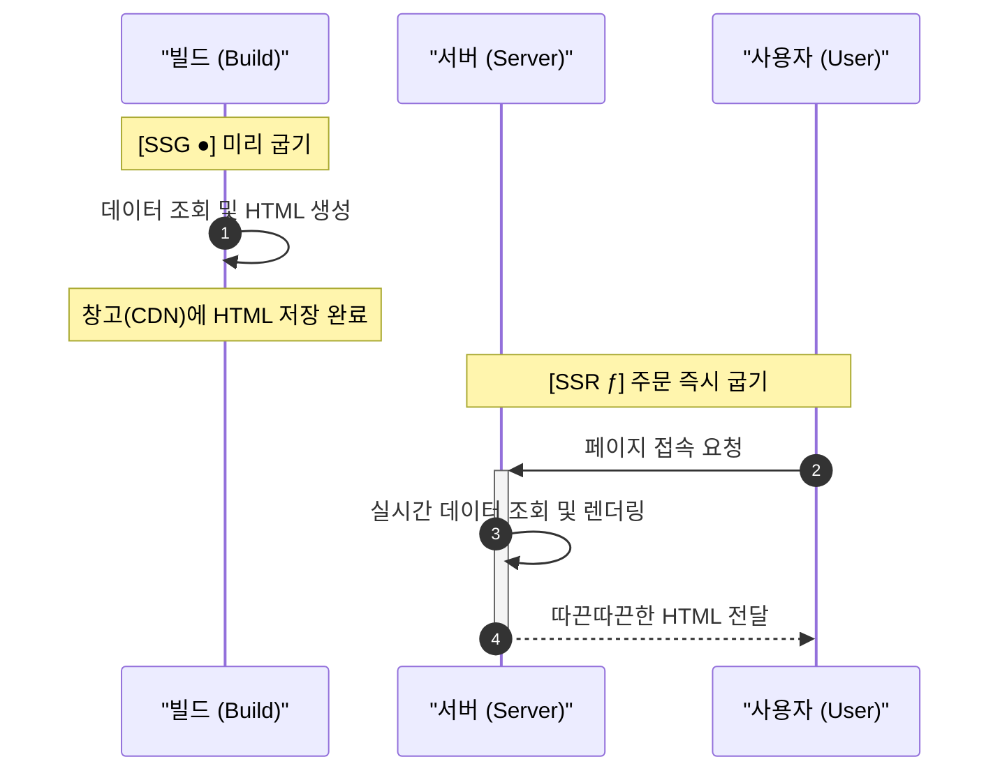
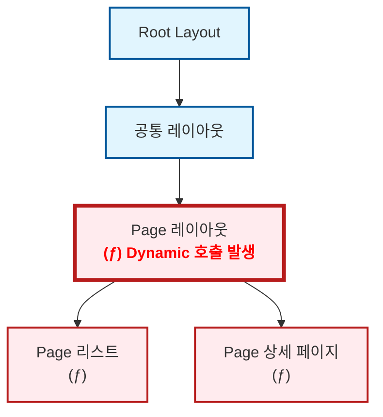

## 𝓓𝔂𝓷𝓪𝓶𝓲𝓬해진 내 블로그

블로그 개발을 처음 시작할 때만 해도 Next.js에 대해 제대로 알지 못했습니다. "일단 굴러가게 만들고, 틀린 건 나중에 고치면 되지"라는 가벼운 마음으로 코드를 쌓아 올렸죠. 그렇게 제 블로그는 어느덧 (제 의도와는 다르게) 아주 𝓓𝔂𝓷𝓪𝓶𝓲𝓬한 사이트가 되어 있었습니다.

물론 믿는 구석은 있었습니다. Next.js에는 [`generateStaticParams`](https://nextjs.org/docs/app/api-reference/functions/generate-static-params)라는 마법 같은 함수가 있으니까요. "나중에 이거 한 줄만 적어주면 전부 SSG로 변하겠지"라며 근거 없는 자신감으로 작업을 미뤄왔습니다.

그리고 드디어 결전의 날, 야심 차게 `generateStaticParams` 함수를 작성하고 빌드 명령어를 입력했습니다. 결과는...


**⁽⁽◝( ˙ ꒳ ˙ )◜⁾⁾** **짜잔! 아무 일도 일어나지 않았습니다.**

터미널을 가득 채운 동그란 아이콘을 기대했지만, 제 눈앞에 나타난 건 여전히 서슬 퍼런 다이나믹 기호 뿐이었습니다. 분명 공식 문서대로 구현했는데, 왜 제 블로그는 정적 생성을 거부하는 걸까요? 오늘은 그 삽질의 기록을 공유합니다.

## 정적과 동적 이해하기

원인을 파악하려면 Next.js가 왜 상세 페이지를 동적 경로로 구분했는지 찾아봐야겠죠. 그러기 위해서는 먼저 Next.js에서 말하는 **정적(Static)**&#xACFC; **동적(Dynamic)**&#xC758; 개념을 잡고 갈 필요가 있습니다.



Next.js에서 말하는 **정적**은 다른 말로 <u>SSG(Static Site Generation)</u>, 그리고 **동적**은 <u>SSR(Server Side Rendering)</u>로 말할 수 있습니다. CSR(Client Side Rendering)과는 다소 다른 개념인 것 같은데 어떻게 이런 구분이 가능한걸까요? 그건 바로 이 두 방식의 페이지의 생성 시점이 다르기 때문입니다.

SSG는 페이지를 <u>빌드 시에 생성</u>합니다. 때문에 SSG는 모든 데이터가 빌드할 때 고정되야하는 데이터로 구성되어야하며, 즉 **정적(Static)**&#xC785;니다.&#x20;

반대로 SSR은 사용자가 요청 시 서버에서 <u>실시간으로 페이지를 만들어서 사용자에게 전달</u>하기 때문에 그때그때 바뀌는 데이터를 참조할 수 있습니다. 즉, **동적(Dynamic)**&#xC785;니다.

즉, Next.js에서 이 페이지는 정적 페이지이고, 이 페이지는 동적 페이지로 빌드되었다라는 표시는 이 페이지를 '언제 생성할 것이냐'를 구분했다는 의미입니다.

## Next.js의 정적 판정

```ts
export async function generateStaticParams() {
	const slugs = await getPostSlugs();

	return slugs.map((slug) => ({ slug }));
}
```

자, 그럼 다시 돌아와봅시다. `generateStaticParams` 함수는 원래라면 운영 시에 실시간으로 바뀌는 **동적 경로(`/[slug]`)**&#xC5D0; 대해서 URL 리스트를 제출하여 이를 **정적 경로**로 동작하게 만들어주는 역할을 합니다. 즉, 이런이런 URL이 있으니 이 URL들은 미리 정적으로 생성해줘 라고 요청하는거죠.

하지만 여기서 알아둬야 할 사실이 있습니다. `generateStaticParams`로 URL 목록을 제출했다고 해서 Next.js가 그 페이지를 무조건 SSG로 만들어주는 것은 아닙니다. 해당 라우트가 빌드 시점에 결정 가능한 데이터만 사용해야 비로소 정적으로 생성됩니다.

Next.js는 라우트 세그먼트를 따라 정적 렌더링 가능 여부를 판단합니다. 이 과정에서 `cookies()`, `headers()`, `draftMode()`, 페이지의 `searchParams` prop처럼 요청 시점에만 알 수 있는 [Dynamic API](https://nextjs-ko.org/docs/app/building-your-application/rendering/server-components#dynamic-functions)가 끼어들면, 그 경로는 더 이상 순수한 정적 경로로 유지되기 어려워집니다.



## 동적 요소 제거하기

이제 원인을 알았으니 다시 코드를 보러 갔습니다. 그리고 보았습니다. 수많은 동적 요소들이 상세 페이지를 렌더링하기 위해 애쓰고 있는 것을요. 이러니 `generateStaticParams` 조금 적었다고 SSG로 렌더링이 될리가 없었습니다.

### reader 관심사 분리하기

가장 먼저 칼을 댄 곳은 데이터를 읽어오는 핵심 로직인 `reader`였습니다. 제 블로그는 Keystatic을 사용해 게시글을 관리하는데, 기존의 `reader` 함수는 단순한 데이터 조회를 넘어 너무 많은 '실시간성' 일을 하고 있었습니다.

<Tabs>
  <Tab label="Before">
    ```ts
    import { createReader } from "@keystatic/core/reader";
    import { createGitHubReader } from "@keystatic/core/reader/github";
    import { cookies, draftMode } from "next/headers";
    import keystaticConfig from "@/root/keystatic.config";
    import { isRemotePreviewEnabled } from "./runtime";

    export const reader = async () => {
    	let isDraftModeEnabled = false;

    	try {
    		const draftModeStore = await draftMode();

    		isDraftModeEnabled = draftModeStore.isEnabled;
    	} catch (error) {
    		console.error(error);
    	}

    	if (isRemotePreviewEnabled() && isDraftModeEnabled) {
    		const cookieStore = await cookies();
    		const branch = cookieStore.get("ks-branch")?.value;

    		if (branch) {
    			return createGitHubReader(keystaticConfig, {
    				repo: `${process.env.NEXT_PUBLIC_KEYSTATIC_OWNER}/${process.env.NEXT_PUBLIC_KEYSTATIC_REPO}`,
    				ref: branch,
    				token: cookieStore.get("keystatic-gh-access-token")?.value,
    			});
    		}
    	}

    	return createReader(process.cwd(), keystaticConfig);
    };

    ```
  </Tab>

  <Tab label="After">
    ```ts
    import { createReader } from "@keystatic/core/reader";
    import { createGitHubReader } from "@keystatic/core/reader/github";
    import type { ContentAccessOptions } from "@/libs/contents/types";
    import keystaticConfig from "@/root/keystatic.config";
    import { shouldUseRemotePreview } from "./runtime";

    export const reader = async (options: ContentAccessOptions = {}) => {
    	const preview = options.preview;

    	if (preview && shouldUseRemotePreview(options)) {
    		return createGitHubReader(keystaticConfig, {
    			repo: `${process.env.NEXT_PUBLIC_KEYSTATIC_OWNER}/${process.env.NEXT_PUBLIC_KEYSTATIC_REPO}`,
    			ref: preview.branch,
    			token: preview.token,
    		});
    	}

    	return createReader(process.cwd(), keystaticConfig);
    };
    ```
  </Tab>
</Tabs>

기존 `reader`는 함수 내부에서 직접 `cookies()`와 `draftMode()`를 호출하고 있었습니다. 이 방식의 치명적인 단점은, 단순히 글 목록을 가져오고 싶어서 이 함수를 호출하기만 해도 해당 페이지 전체가 동적 렌더링(`ƒ`)으로 변해버린다는 것이었습니다. `reader`는 데이터를 읽는 함수인 척하면서, 사실상 "저 지금 요청 상태 같이 보고 있습니다"라고 광고하고 있었던 셈입니다. 이러니 공개 라우트까지 정적으로 굳질 못했던 것이죠.

그래서 `reader` 안에서 직접 동적 요소를 읽는 방식은 버리고, preview에 필요한 정보만 바깥에서 넘겨받도록 바꿨습니다. 그제서야 `reader`는 정말로 '읽기만 하는 함수'가 되었습니다.&#x20;

이제 빌드 시점에는 아무 옵션 없이 정적으로 글을 읽고, 정말 preview가 필요한 순간에만 바깥에서 관련 정보를 넘겨주면 됩니다. 덕분에 적어도 데이터 읽는 층에서부터 사이트를 𝓓𝔂𝓷𝓪𝓶𝓲𝓬하게 만드는 일은 막을 수 있었습니다.

### searchParams 유배 보내기

그다음으로 수술대에 올린 것은 상세 페이지에 깊숙이 침투해 있던 `searchParams`였습니다.

제 블로그는 카테고리 필터를 쿼리 스트링(`?category=...`)으로 관리합니다. 문제는 이 상태값을 상세 페이지까지 끌고 들어오면서 발생했습니다. '뒤로 가기', '이전 글/다음 글' 링크가 모두 현재 쿼리를 기준으로 동작하다 보니, 정작 `slug`만 있으면 충분해야 할 상세 페이지가 "현재 사용자의 접속 맥락"까지 책임져야 하는 상황이 된 것입니다.

```tsx
export default async function BlogPost({ params, searchParams }: BlogPageProps) {
  const { slug } = await params;
  const query = await searchParams; // 이 시점부터 페이지는 요청 시점의 쿼리에 의존하게 됨

  const post = await getPost(slug);
  const postList = await getPostList(query); // 쿼리에 따라 결과가 달라짐

  // ... 인덱스 계산 및 이전/다음 글 추출 로직 ...

  return (
    <nav>
      <Link href={{ pathname: `/posts/${prevPost.slug}`, query }}>이전 글</Link>
      <Link href={{ pathname: `/posts/${nextPost.slug}`, query }}>다음 글</Link>
    </nav>
  );
}
```

이 구조에서 상세 페이지는 단순히 글을 보여주는 곳이 아니라, "지금 사용자가 어떤 카테고리 필터를 활성화했는가"라는 실시간 상태를 감시해야 합니다. 결과적으로 이 구조에서는 상세 페이지가 빌드 시점에만 결정되는 페이지로 남기 어려워집니다.

그래서 방향을 바꿨습니다. 상세 페이지는 글 내용과 기본 목록만 정적으로 들고 있게 두고, 현재 쿼리를 읽는 일은 아예 클라이언트 내비게이션으로 분리한 것입니다.

```tsx
export default async function BlogPost({ params }: BlogPageProps) {
  const { slug } = await params;
  const post = await getPost(slug);
  const postList = await getPostList(); // 쿼리 없이 전체 리스트를 가져와 정적 생성 가능

  return <PostDetailPageContent post={post} postList={postList.list} />;
}
```

대신 이전 글, 다음 글, 돌아가기 링크처럼 정말로 현재 쿼리가 필요한 부분만 클라이언트 컴포넌트로 따로 빼냈습니다.

여기서 끝이 아니었습니다. `useSearchParams()`를 쓰는 컴포넌트를 그냥 꽂아 넣기만 하면, 정적으로 렌더링하고 싶은 경로에서도 그 경계가 흐려질 수 있습니다. 그래서 저는 이 내비게이션을 `Suspense`로 한 번 더 감쌌습니다.

```tsx
export const PostDetailNavigation = ({ currentSlug, items, prevPost, nextPost }) => {
  return (
    <Suspense fallback={<DefaultNavigation prevPost={prevPost} nextPost={nextPost} />}>
      {/* 클라이언트 사이드에서만 쿼리를 읽어 링크를 보정함 */}
      <PostDetailNavigationClient currentSlug={currentSlug} items={items} />
    </Suspense>
  );
};
```

이렇게 하면 Next.js 빌드 엔진은 다음과 같이 동작합니다.

1. 빌드 시점: 쿼리를 모르는 상태에서도 `fallback`에 정의된 '정적 껍데기'를 포함해 전체 페이지를 미리 HTML로 구워냅니다.
2. 런타임(브라우저): 페이지가 로드된 후 클라이언트에서 `useSearchParams()`를 읽어, 사용자가 보고 있던 카테고리에 맞는 링크로 부드럽게 보정합니다.

결국 `searchParams`를 없앤 것이 아니라, 정적이어야 하는 '본질'과 런타임에만 알아도 되는 '맥락'을 `Suspense`라는 경계선으로 확실히 갈라놓은 셈입니다. 이를 통해 상세 페이지는 이제 본연의 임무인 '글 보여주기'에만 집중하게 되었고, 흔들리는 정보들은 모두 클라이언트 쪽으로 밀어내 정적 렌더링 경계를 조금 더 분명하게 만들 수 있었습니다.

### 공통 layout에서 preview 떼어내기

`reader`를 수술했고 `searchParams`도 유배 보냈습니다. 이제는 정말 정적 페이지다운 영롱한 동그라미(●)가 나와줄 때도 됐는데, 이상하게도 블로그 전체에는 여전히 동적인 기운(ƒ)이 감돌고 있었습니다. 다시 코드를 훑어보니 범인은 상세 페이지가 아니라, 그 위를 넓게 덮고 있던 공통 레이아웃(Root Layout)이었습니다.

당시 제 블로그의 공통 레이아웃은 단순히 테마만 입히는 곳이 아니었습니다. `draftMode()`와 `cookies()`를 직접 읽어 현재 preview 상태인지 확인하고, 화면 하단에 Draft 배너까지 띄우고 있었죠. 사용자 편의를 위한 기능이었지만, 문제는 이 로직이 모든 페이지의 부모인 공통 레이아웃에 붙어 있었다는 점이었습니다.

```tsx title="app/layout.tsx"
import { cookies, draftMode } from "next/headers";

export default async function RootLayout({ children }) {
  const { isEnabled } = await draftMode();
  const cookieStore = await cookies();
  const branch = cookieStore.get("ks-branch")?.value;

  return (
    <ThemeProvider>
      {children}
      {isEnabled && (
        <div className="fixed bottom-0">Draft mode (branch: {branch})</div>
      )}
    </ThemeProvider>
  );
}

```

앞서 말했듯, 라우트 세그먼트 트리에서 동적 요소가 발견되면, 하위의 모든 노드 역시 동적 렌더링 페이지로 판단하게 됩니다. 저의 경우 가장 최상위였던, 공통 레이아웃에서 Dynamic API를 사용 중이었으니, 그 하위 페이지들이 동적 렌더링 페이지로 분류되는 건 당연한 일이었습니다.

```tsx title="app/layout.tsx"
export default function RootLayout({ children }) {
  return (
    <ThemeProvider attribute="class">
      {children}
    </ThemeProvider>
  );
}
```

이를 해결하기 위해 먼저 공개 레이아웃에서 preview 관련 책임을 완전히 걷어냈습니다. 공개 페이지는 더 이상 draft mode가 켜졌는지, 어느 브랜치를 보고 있는지 알 필요가 없기 때문입니다. 대신 preview에만 필요한 동적 처리는 preview 전용 레이아웃으로 따로 격리했습니다.

```tsx title="app/preview/layout.tsx"
export const dynamic = "force-dynamic";

export default async function PreviewLayout({ children }) {
  const contentOptions = await getPreviewContentOptionsFromRequest();
  const branch = contentOptions.preview?.branch;

  return (
    <>
      {children}
      {branch && (
        <div className="fixed bottom-0">Draft mode (branch: {branch})</div>
      )}
    </>
  );
}
```

이렇게 하고 나니 구조가 훨씬 솔직해졌습니다. 공개 페이지는 preview 상태를 전혀 몰라도 되고, preview 경로에서만 관련 정보를 읽으면 됩니다. 예전에는 공개 페이지와 preview 페이지가 한집에 살며 서로의 짐을 억지로 나눠 들고 있었다면, 이제는 아예 주소를 갈라버린 셈입니다.

여기에 `export const dynamic = "force-dynamic"`까지 명시하면서, preview는 처음부터 정적 생성 대상이 아니라는 점도 분명히 했습니다.

## 마무리 - SSG는 설계부터


이렇게 하고 빌드를 하니 드디어 페이지들이 SSG로 동작하기 시작했습니다. 실제로 게시글 클릭 시 상세 페이지 로딩에 걸리던 시간도 1초 정도에서 별도의 딜레이 없이 바로 로딩되도록 수정되었구요.

단순히 `generateStaticParams`만 한 줄 적어주면 모든 문제가 해결될 것이라 기대했던 처음과 달리, 실제 SSG로 가는 길은 훨씬 더 복잡하고 치밀한 설계가 필요했습니다.

이번 과정을 통해 깨달은 것은 Next.js의 정적 생성은 단순히 기능 하나를 켜고 끄는 문제가 아니라는 점입니다. 결국 중요한 것은 데이터의 흐름과 컴포넌트의 책임, 그리고 동적인 정보가 머물 자리를 어디까지 허용할 것인가였습니다.

* 관심사 분리: 데이터 로직(`reader`)에서 동적 API를 제거해 '순수 함수'로 만들었습니다.
* 런타임 격리: `searchParams`처럼 요청 시점에만 알 수 있는 정보는 `Suspense`와 클라이언트 컴포넌트의 영역으로 '유배' 보냈습니다.
* 경로의 독립: 프리뷰처럼 태생이 동적인 기능은 공통 레이아웃에서 떼어내 별도의 주소지로 독립시켰습니다.

결국 제가 마주했던 서슬 퍼런 다이나믹 기호(`ƒ`)들은 제 코드가 나쁘다는 뜻이 아니라, "여기엔 아직 실시간성이 섞여 있다"는 사실을 알려주는 생각보다 정직한 경고였습니다.

혹시 여러분의 블로그도 의도치 않게 너무 다이나믹한 상태는 아니신가요? 지금 당장 빌드 명령어를 입력해 보세요. 범인은 생각보다 가까운 곳에, 여러분의 코드 속에 숨어 있을지도 모릅니다.
