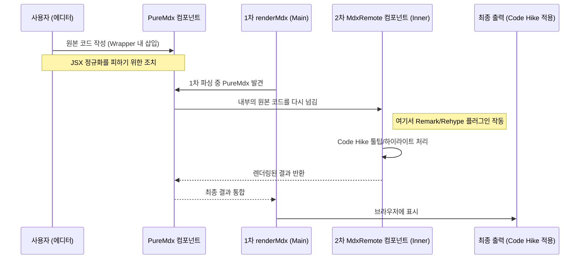

블로그를 시작할 때 지인으로부터 추천 받은 라이브러리가 있었습니다. 바로 [Code Hike](https://codehike.org/)라는 코드 블럭 라이브러리인데요. "단순한 코드 블럭 질리지 않나요? 이걸로 코드 블록에 툴팁도 띄우고, 탭도 띄우고, 슬라이드 쇼도 해보세요!"라는 엄청난 라이브러리였습니다. 세상에 누구나 혹할 엄청난 기능 아닌가요? 당연히 안 써볼 수가 없었죠.

그런데 막상 써보니까 만족도가 높지 않더군요. 분명 멋진 라이브러리인데 왜 만족스럽지 않았을까요? 그래서 오늘은 그저 코드 블럭에 툴팁을 띄우고 싶었을 뿐인 제가 어쩌다보니 커스텀 주석 파싱 시스템을 만들게 된 이야기를 공유하고자 합니다.

## 넌 멋지지만 나랑 안 맞아

앞서 말했듯 Code Hike는 멋진 라이브러리입니다. 그런데 왜 이렇게 만족도가 떨어졌을까요? 그 이유는 바로 **에디터 환경에서 글을 작성하는 워크플로우** 때문이었습니다.

````mdx title="Code Hike 툴팁 예제"
<CodeWithTooltips>

```js !code
// !tooltip[/lorem/] description
function lorem(ipsum, dolor = 1) {
  const sit = ipsum == null ? 0 : ipsum.sit
  dolor = sit - amet(dolor)
  // !tooltip[/consectetur/] inspect
  return sit ? consectetur(ipsum) : []
}
```

## !!tooltips description

### Hello world

Lorem ipsum **dolor** sit amet `consectetur`.

Adipiscing elit _sed_ do eiusmod.

## !!tooltips inspect

```js
function consectetur(ipsum) {
  const { a, b } = ipsum
  return a + b
}
```

</CodeWithTooltips>
````

예를 들어 Code Hike로 툴팁을 작성하기 위해서는 위와 같이 CodeWithTooltips 컴포넌트 내부에 코드 블럭을 작성해야 합니다.&#x20;

일반적인 마크다운에서 글을 작성한다면 문제가 없었겠지만, 저는 에디터를 사용하기 때문에 위 코드를 별도의 처리 없이 본문에 그대로 작성하면, 저장 과정에서 일부 문자가 정규화가 되어서 컴포넌트로 인식이 되지 않습니다.

그래서 처음에는 간단하게 PureMdx라는 커스텀 컴포넌트를 도입해 해결했습니다. 컴포넌트의 속성은 정규화 대상이 아니었거든요. 하지만 또 다른 문제가 발생했는데, 컴포넌트를 사용할 경우 복잡한 렌더링 파이프라인을 거쳐야한다는 점이었습니다.



커스텀 컴포넌트는 정규화되지 않은 MDX 본문을 저장할 수 있었지만, 결국 MDX이기 때문에 이를 다시 꺼내 파이프라인을 타게 만들어야한다는 단점이 있었습니다. 때문에 제 코드에서는 `renderMdx`라는 렌더링 함수로 먼저 파싱을 하고, 추가로 내부 본문을 `MdxRemote`라는 컴포넌트를 통해 다시 파싱해주는 복잡한 과정을 거쳐야했죠.

설령 그렇게 해서 툴팁을 렌더링했다고 생각해봅시다. 그러고 나서 에디터를 바라보면 버젓이 <Tooltip content="나는 툴팁">툴팁</Tooltip> 버튼이 있는걸 볼 수 있습니다.


세상에… 그냥 텍스트를 드래그해서 툴팁 버튼만 누르면 되는걸, 툴팁 하나 띄우자고 이런 프로세스를 구축해야하다니 굉장히 불편하지 않나요? 게다가 자동완성도 안되는 코드블럭에서 일일이 정규표현식으로 지정해가면서 툴팁을 띄워야하다니! 그냥 코드 블록에 드래그해서 버튼만 누를 수 있다면 에디터에서 지원하는 UI로 편집도 가능하고, 가장 베스트일텐데요!

안타깝게도 Keystatic에서 제공하는 기본 코드 블럭 컴포넌트에서는 이런 인라인 블럭을 사용할 수 없었습니다. 또 코드 블록 내에서는 '컴포넌트'를 사용할 수 없었습니다. 이제 렌더링해야하는 컴포넌트인지 아니면 보여져야하는 코드 텍스트인지 구분할 수 없었으니까요.

대체 왜… 툴팁 하나를 띄우자고 이런 불편함을 감수해야하는 걸까요? 저는 이때 커스텀 주석 파싱 시스템을 개발하기로 마음 먹었습니다.

## 2. 코드와 Annotation의 거리두기

제가 정말 풀고 싶었던 문제는 심플했습니다. 코드 블록 안의 특정 단어를 드래그해서 **strong**을 적용하거나 **Tooltip**을 띄우는, 아주 기본적인 기능을 구현하고 싶었을 뿐이죠. 그렇다고 이걸 위해 코드 본문 전체를 복잡한 MDX 컴포넌트 문법으로 감싸고 싶지는 않았습니다. 코드는 가능한 한 코드답게 남아 있어야 한다고 생각했거든요. 제가 원한 건 코드는 평소 쓰던 형태로 두고, 그 위에 annotation 정보만 덧붙이는 방식이었습니다.

```ts title="shiki의 decorations 예제"
import { codeToHtml } from 'shiki'

const code = `
const x = 10
console.log(x)
`.trim()

const html = await codeToHtml(code, {
  theme: 'vitesse-light',
  lang: 'ts',
  // @line highlight
  decorations: [ 
    {
      start: { line: 1, character: 0 },
      end: { line: 1, character: 11 },
      properties: { class: 'highlighted-word' }
    }
  ]
  // @line highlight end
})
```

이 방향에 확신을 준 힌트가 바로 [Shiki의 decorations](https://shiki.style/guide/decorations)였습니다. 적어도 제게는 “코드 본문은 그대로 두고, 별도의 범위 정보만 렌더링 단계에서 반영할 수 있다”는 방식으로 보였거든요. 제가 원하던 것도 딱 그쪽에 가까웠습니다. 코드를 다른 문법으로 뒤덮는 대신, 코드와 annotation을 분리해서 다루는 방식 말입니다.

문제는 그 annotation 정보를 어디에 저장하느냐였습니다. 코드 블록 안에 임의의 마킹 문법을 직접 넣어버리면 구문 강조가 쉽게 깨지고, 반대로 데이터를 코드 바깥의 별도 필드로 분리하면 코드를 한 줄만 수정해도 위치 정보와 본문을 계속 맞춰야 했습니다. 어느 쪽이든 썩 마음에 드는 방식은 아니었습니다.

결국 돌고 돌아 찾은 답은 **주석**이었습니다. 주석은 코드 블록 안에 자연스럽게 남겨둘 수 있으면서도, annotation 정보를 원본 코드와 가장 가까운 위치에서 함께 관리할 수 있는 형식이었기 때문입니다. 단순히 익숙한 문법이라서가 아니라, 코드와 annotation을 분리하면서도 둘의 관계를 완전히 끊어놓지 않을 수 있는 저장 형식이었던 셈입니다.

이제 남은 문제는 하나였습니다. 이 주석을 어떻게 다뤄야, 에디터에서는 다시 원래의 편집 가능한 구조처럼 복원할 수 있을까요?

## 에디터와 주석의 Collaboration

여기서부터의 문제는 단순히 "주석을 어떤 문법으로 적을까?"가 아니었습니다. 진짜 어려운 지점은 에디터에서 선택한 인라인 블럭과, 저장 시점의 주석 표현 사이를 어떻게 자연스럽게 오가게 만드느냐였습니다. 사용자는 그저 코드 블록 안의 특정 범위를 드래그한 뒤 **strong**이나 **Tooltip** 버튼을 누를 뿐인데, 저장될 때는 그 정보가 주석으로 바뀌고, 다시 열었을 때는 원래의 편집 가능한 구조로 복원되어야 했으니까요.

즉 에디터와 파일은 서로 다른 구조를 필요로 했습니다. 에디터에게는 Tooltip이나 strong 같은 의미를 직접 다룰 수 있는 인라인 블럭 구조가 필요했고, 파일 입장에서는 그 정보를 코드 블록 안에 남겨둘 수 있는 직렬화된 표현이 필요했습니다. 저는 이 둘을 하나로 우겨 넣기보다, 서로 다른 표현으로 인정한 뒤 중간에서 변환해 주는 편이 더 현실적이라고 판단했습니다.

그래서 저장할 때는 인라인 블럭 정보를 읽어 주석으로 직렬화하고, 다시 불러올 때는 그 주석을 파싱해 편집 가능한 구조로 복원하는 파이프라인을 만들게 되었습니다. 말은 간단하지만, 실제로는 Keystatic이 내부에서 MDX를 어떤 구조로 다루는지 먼저 파악해야 했고, 기본 코드 블록 컴포넌트만으로는 원하는 동작이 나오지 않아 일부는 직접 패치도 해야 했습니다. 결국 제가 만든 것은 단순한 주석 파서가 아니라, 에디터와 파일 사이를 오가는 왕복 변환기(round-trip pipeline)에 가까웠습니다.

이쯤 오고 나니 주석의 역할도 분명해졌습니다. 주석은 최종 렌더링을 위한 장식이 아니라, 에디터가 만든 의미를 파일 안에 안전하게 보관해 두는 중간 표현이었습니다. 그리고 다음 단계의 고민도 자연스럽게 이어졌습니다. 그렇다면 이 주석은 어떤 형태여야, 다시 읽어 왔을 때 무리 없이 원래 구조로 복원할 수 있을까?

