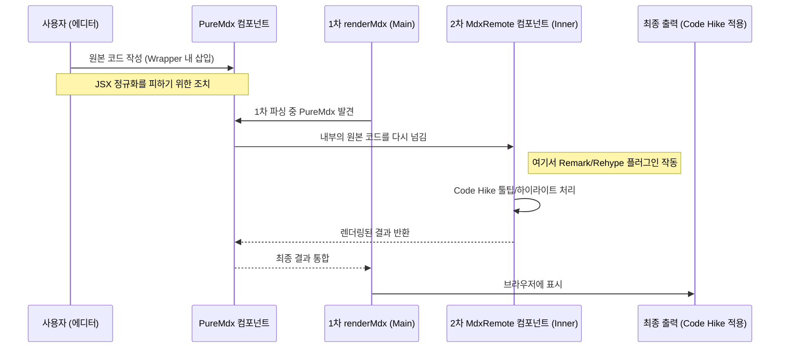

블로그를 시작할 때 지인으로부터 추천 받은 라이브러리가 있었습니다. 바로 [Code Hike](https://codehike.org/)라는 코드 블럭 라이브러리인데요. 코드 블럭을 더 예쁘게 보여준다. 이걸로 코드 블록에 툴팁도 띄우고, 탭도 띄우고, 슬라이드 쇼도 할 수 있다! 라는 엄청난 라이브러리였습니다. 안 써볼 수가 없었죠.

그런데 막상 써보니까 만족도가 높지 않더군요. 분명 멋진 라이브러리인데 왜 만족스럽지 않았을까요? 그래서 오늘은 그저 코드 블럭에 툴팁을 띄우고 싶었을 뿐인 제가 어쩌다보니 커스텀 주석 파싱 시스템을 만들게 된 이야기를 공유하고자 합니다.

## 넌 멋지지만 나랑 안 맞아

앞서 말했듯 Code Hike는 멋찐\~ 라이브러리입니다. 그런데 왜 이렇게 만족도가 떨어졌을까요? 왜 그런지 고민해봤더니 **에디터 환경에서 글을 작성하는 워크플로우**가 큰 걸림돌이었습니다.

````mdx title="Code Hike 툴팁 예제"
<CodeWithTooltips>

```js !code
// !tooltip[/lorem/] description
function lorem(ipsum, dolor = 1) {
  const sit = ipsum == null ? 0 : ipsum.sit
  dolor = sit - amet(dolor)
  // !tooltip[/consectetur/] inspect
  return sit ? consectetur(ipsum) : []
}
```

## !!tooltips description

### Hello world

Lorem ipsum **dolor** sit amet `consectetur`.

Adipiscing elit _sed_ do eiusmod.

## !!tooltips inspect

```js
function consectetur(ipsum) {
  const { a, b } = ipsum
  return a + b
}
```

</CodeWithTooltips>
````

예를 들어 Code Hike로 툴팁을 작성하기 위해서는 위와 같이 컴포넌트 내부에 코드 블럭을 작성하는 방식을 사용해야 합니다.&#x20;

일반적인 마크다운에서 글을 작성한다면 문제가 없었겠지만, 저는 에디터를 사용하기 때문에 위 코드를 별도의 처리 없이 본문에 그대로 작성하면 저장 과정에서 정규화가 되어서 컴포넌트로 파싱이 되지 않습니다.

처음에는 간단하게 PureMdx라는 커스텀 컴포넌트를 도입해 해결했습니다. 하지만 또 다른 문제가 발생했는데, 바로 복잡한 렌더링 파이프라인을 거쳐야한다는 점이었습니다.



커스텀 컴포넌트는 정규화되지 않은 MDX 본문을 저장할 수 있었지만, 결국 MDX이기 때문에 이를 다시 꺼내 파이프라인을 타게 만들어야한다는 단점이 있었습니다. 때문에 제 코드에서는 `renderMdx`라는 렌더링 함수로 먼저 파싱을 하고, 추가로 내부 본문을 `MdxRemote`라는 컴포넌트를 통해 다시 파싱해주는 복잡한 과정을 거쳐야했죠.

설령 그렇게 해서 툴팁을 렌더링했다고 생각해봅시다. 그러고 나서 에디터를 바라보면 위처럼 버젓이 <Tooltip content="나는 툴팁">툴팁</Tooltip> 버튼이 있는걸 볼 수 있습니다.

세상에… 그냥 텍스트를 드래그해서 툴팁 버튼만 누르면 되는걸, 툴팁 하나 띄우자고 이런 프로세스를 구축해야하다니 굉장히 불편하지 않나요? 게다가 자동완성도 안되는 MDX에서 일일이 정규표현식으로 지정해가면서 툴팁을 띄워야하다니! 그냥 코드 블록에 드래그해서 바로 툴팁을 작성하면 에디터에서 지원하는 UI로 편집도 가능하고, 가장 베스트일텐데요!

안타깝게도 Keystatic에서 제공하는 기본 코드 블럭 컴포넌트에서는 이런 인라인 블럭을 사용할 수 없었습니다. 대체 왜… 툴팁 하나를 띄우자고 이런 불편함을 감수해야하는걸까요? 저는 이때 커스텀 주석 파싱 시스템을 개발하기로 마음 먹었습니다.
