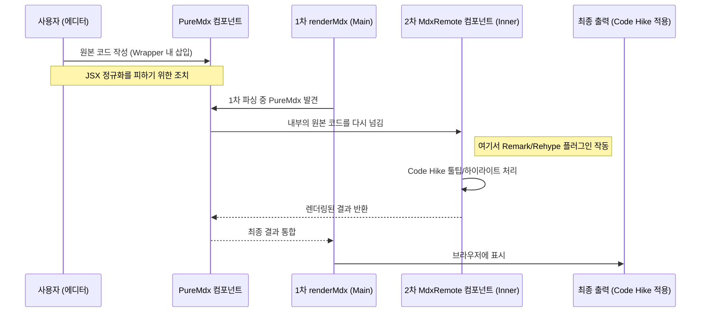
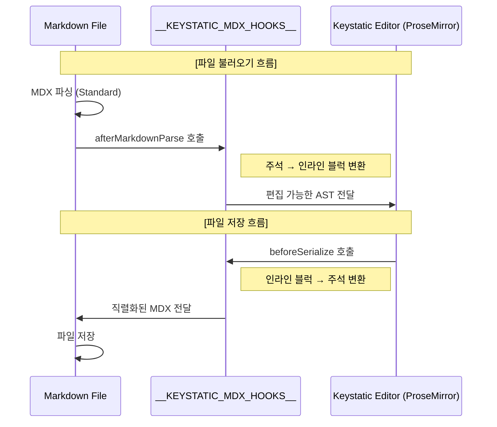
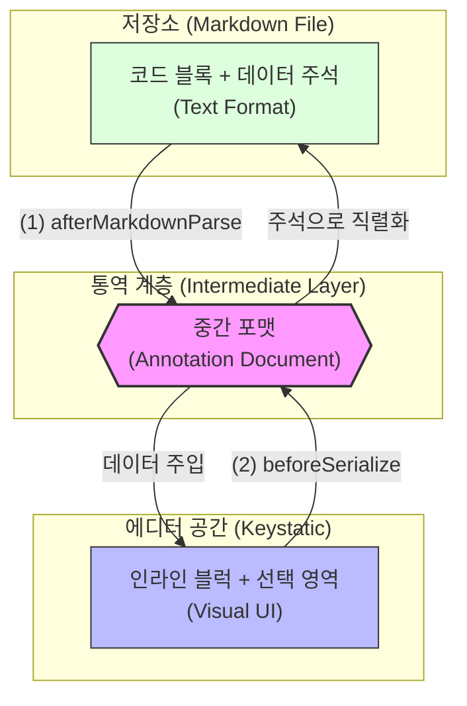
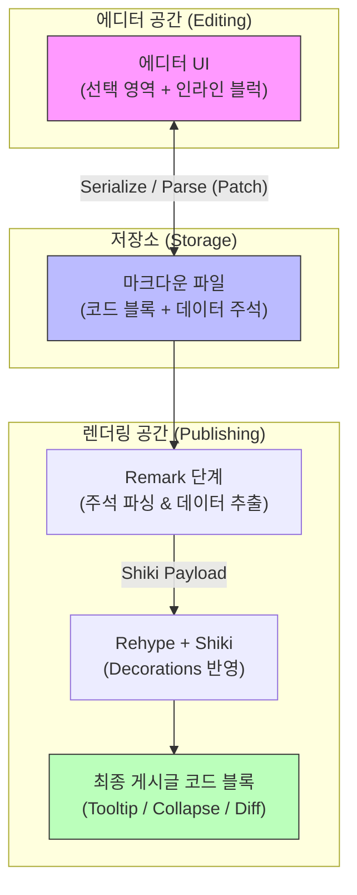

블로그를 시작할 때 지인으로부터 추천 받은 라이브러리가 있었습니다. 바로 [Code Hike](https://codehike.org/)라는 코드 블럭 라이브러리인데요. *"단순한 코드 블럭 질리지 않나요? 이걸로 코드 블록에 툴팁도 띄우고, 탭도 띄우고, 슬라이드 쇼도 해보세요!"*&#xB77C;는 엄청난 라이브러리였습니다. 세상에 누구나 혹할 엄청난 기능 아닌가요? 당연히 안 써볼 수가 없었죠.

그런데 막상 써보니까 만족도가 높지 않더군요. 분명 멋진 라이브러리인데 왜 만족스럽지 않았을까요? 그래서 오늘은 그저 코드 블럭에 툴팁을 띄우고 싶었을 뿐인 제가 어쩌다보니 커스텀 주석 파싱 시스템을 만들게 된 이야기를 공유하고자 합니다.

## 넌 멋지지만 나랑 안 맞아

앞서 말했듯 Code Hike는 멋진 라이브러리입니다. 그런데 왜 이렇게 만족도가 떨어졌을까요? 그 이유는 바로 **에디터 환경에서 글을 작성하는 워크플로우** 때문이었습니다.

````mdx title="Code Hike 툴팁 예제"
<CodeWithTooltips>

```js !code
// !tooltip[/lorem/] description
function lorem(ipsum, dolor = 1) {
  const sit = ipsum == null ? 0 : ipsum.sit
  dolor = sit - amet(dolor)
  // !tooltip[/consectetur/] inspect
  return sit ? consectetur(ipsum) : []
}
```

## !!tooltips description

### Hello world

Lorem ipsum **dolor** sit amet `consectetur`.

Adipiscing elit _sed_ do eiusmod.

## !!tooltips inspect

```js
function consectetur(ipsum) {
  const { a, b } = ipsum
  return a + b
}
```

</CodeWithTooltips>
````

예를 들어 Code Hike로 툴팁을 작성하기 위해서는 위와 같이 CodeWithTooltips 컴포넌트 내부에 코드 블럭을 작성해야 합니다.&#x20;

일반적인 마크다운에서 글을 작성한다면 문제가 없었겠지만, 저는 에디터를 사용하기 때문에 위 코드를 별도의 처리 없이 본문에 그대로 작성하면, 저장 과정에서 일부 문자가 정규화가 되어서 컴포넌트로 인식이 되지 않습니다.

그래서 처음에는 간단하게 PureMdx라는 커스텀 컴포넌트를 도입해 해결했습니다. 컴포넌트의 속성은 정규화 대상이 아니었거든요. 하지만 또 다른 문제가 발생했는데, 컴포넌트를 사용할 경우 복잡한 렌더링 파이프라인을 거쳐야한다는 점이었습니다.



보기만 해도 복잡하지 않나요? 커스텀 컴포넌트는 정규화되지 않은 MDX 본문을 저장할 수 있었지만, 결국 MDX이기 때문에 이를 다시 꺼내 파이프라인을 타게 만들어야한다는 단점이 있었습니다. 때문에 제 코드에서는 `renderMdx`라는 렌더링 함수로 먼저 파싱을 하고, 추가로 내부 본문을 `MdxRemote`라는 컴포넌트를 통해 다시 파싱해주는 과정을 거쳐야했죠.

설령 그렇게 해서 툴팁을 렌더링했다고 생각해봅시다. 그러고 나서 에디터를 바라보면 버젓이 <Tooltip content="나는 툴팁">툴팁</Tooltip> 버튼이 있는걸 볼 수 있습니다.


세상에… 그냥 텍스트를 드래그해서 툴팁 버튼만 누르면 되는걸, 툴팁 하나 띄우자고 이런 프로세스를 구축해야하다니 굉장히 불편하지 않나요? 게다가 자동완성도 안되는 코드블럭에서 일일이 정규표현식으로 지정해가면서 툴팁을 띄워야하다니! 그냥 코드 블록에 드래그해서 버튼만 누를 수 있다면 에디터에서 지원하는 UI로 편집도 가능하고, 가장 베스트일텐데요!

안타깝게도 Keystatic에서 제공하는 기본 코드 블럭 컴포넌트에서는 이런 인라인 블럭을 사용할 수 없었습니다. 또 코드 블록 내에서는 '컴포넌트'를 사용할 수 없었습니다. 이제 렌더링해야하는 컴포넌트인지 아니면 보여져야하는 코드 텍스트인지 구분할 수 없었으니까요.

대체 왜… 툴팁 하나를 띄우자고 이런 불편함을 감수해야하는 걸까요?

## 코드와 Annotation의 거리두기

제가 정말 풀고 싶었던 문제는 심플했습니다. 코드 블록 안의 특정 단어를 드래그해서 strong을 적용하거나 Tooltip을 띄우는, 아주 기본적인 기능을 구현하고 싶었을 뿐이죠. 그렇다고 이걸 위해 코드 본문 전체를 복잡한 MDX 컴포넌트 문법으로 감싸고 싶지는 않았습니다. 코드는 가능한 한 코드답게 남아 있어야 한다고 생각했거든요. 제가 원한 건 코드는 평소 쓰던 형태로 두고, 그 위에 annotation 정보만 덧붙이는 방식이었습니다.

```ts title="shiki의 decorations 예제"
import { codeToHtml } from 'shiki'

const code = `
const x = 10
console.log(x)
`.trim()

const html = await codeToHtml(code, {
  theme: 'vitesse-light',
  lang: 'ts',
  // @line highlight
  decorations: [ 
    {
      start: { line: 1, character: 0 },
      end: { line: 1, character: 11 },
      properties: { class: 'highlighted-word' }
    }
  ]
  // @line highlight end
})
```

이 방향에 확신을 준 힌트가 바로 [Shiki의 decorations](https://shiki.style/guide/decorations)였습니다. 적어도 제게는 “코드 본문은 그대로 두고, 별도의 범위 정보만 렌더링 단계에서 반영할 수 있다”는 방식으로 보였거든요. 제가 원하던 것도 딱 그쪽에 가까웠습니다. 코드를 다른 문법으로 뒤덮는 대신, 코드와 annotation을 분리해서 다루는 방식 말입니다.

문제는 그 annotation 정보를 어디에 저장하느냐였습니다. 코드 블록 안에 임의의 마킹 문법을 직접 넣어버리면 구문 강조가 쉽게 깨지고, 반대로 데이터를 코드 바깥의 별도 필드로 분리하면 코드를 한 줄만 수정해도 위치 정보와 본문을 계속 맞춰야 했습니다. 어느 쪽이든 썩 마음에 드는 방식은 아니었습니다.

결국 돌고 돌아 찾은 답은 **주석**이었습니다. 주석은 코드 블록 안에 자연스럽게 남겨둘 수 있으면서도, annotation 정보를 원본 코드와 가장 가까운 위치에서 함께 관리할 수 있는 형식이었기 때문입니다. 단순히 익숙한 문법이라서가 아니라, 코드와 annotation을 분리하면서도 둘의 관계를 완전히 끊어놓지 않을 수 있는 저장 형식이었던 셈입니다.

그리고 나서야 다음 질문이 구체적으로 보이기 시작했습니다. 에디터와 파일 사이를 오가는 이 긴 여정 속에서, 주석은 대체 어떤 형태로 설계되어야 다시 읽어 왔을 때 무리 없이 원래 구조로 복원할 수 있을까요?&#x20;

## 주석 체계를 설계하자

고민 끝에 내린 결론은 의외로 단순했습니다. **'어떤 범위에(Range), 어떤 Annotation이(Type), 어떤 속성(Attrs)과 함께'** 붙어 있는지만 완벽하게 표현하면 그만이었습니다.

이 기준을 세우고 나니 Annotation은 크게 두 종류로 나뉘더군요. 특정 단어나 문구에 걸리는 인라인(Inline) 방식과, 한 줄 혹은 여러 줄 전체에 영향을 주는 라인(Line) 방식입니다. 그래서 문법의 첫 번째 축을 `@char`와 `@line`이라는 스코프(Scope)로 정했습니다. 그 뒤에 Annotation의 이름을 붙이고, 범위가 필요한 경우 `{start-end}`를, 추가 정보는 속성값으로 나열하는 식의 구조를 잡았습니다.

### 문자 단위: @char

사용자가 드래그한 정확한 지점을 마킹합니다. 에디터는 드래그 범위를 계산해 주석을 생성하므로 사용자가 수치를 직접 입력할 일은 없지만, 파일 입장에서는 "이 위치에 툴팁이 있다"는 명확한 설계도가 됩니다.

```ts title="문자 범위 annotation 예시"
// @𝖼𝗁𝖺𝗋 Tooltip {0-12} content="모든 검색엔진 크롤러를 대상으로 규칙 적용"
User-Agent: *
```

### 줄 단위: @line

`@line`은 조금 결이 다릅니다. 툴팁처럼 특정 단어를 감싸는 게 아니라, 코드 접기(Collapse)나 Diff 표시처럼 줄 자체를 꾸며야 하기 때문입니다. 그래서 단일 줄을 가리키거나, `start/end` 형태로 여러 줄 구간을 묶을 수 있도록 설계했습니다. 이 유연한 구조 덕분에 나중에는 `plus`, `minus`, `highlight` 같은 기능들도 이 체계 안에서 자연스럽게 확장할 수 있었습니다.

```ts title="라인 범위 annotation 예시"
// @𝗅𝗂𝗇𝖾 collapse
export async function generateImageMetadata() {
// ...
}
// @𝗅𝗂𝗇𝖾 collapse end
```

결과적으로 이 문법은 사람이 메모장에서 읽기에도 크게 어색하지 않았고, 에디터가 다시 파싱하기에도 충분한 정보를 담고 있었습니다. minus, plus나 @document 형태로 확장 역시 용이했습니다. 마침내 주석의 형태가 결정된 셈이었죠.

## 에디터와 주석의 Collaboration

주석의 형태가 결정되고 나니, 이제 남은 문제는 이 문법을 에디터와 어떻게 호환시킬 것인가였습니다. 에디터에게는 Tooltip이나 strong을 직접 핸들링할 수 있는 객체가 필요했지만, 우리가 설계한 주석 문법은 아직 마크다운 파일에서만 사용 가능했으니까요.

### 데이터 흐름에 개입하기

이 간극을 메우기 위해 저는 Keystatic의 내부 깊숙한 곳을 건드려야 했습니다. 기본 코드 블록 컴포넌트는 애초에 이런 인라인 블럭 편집 모델을 상정하고 있지 않았기 때문입니다. 결국 에디터가 MDX를 파싱하고 다시 직렬화하는 순간에 제 로직을 끼워 넣을 수 있어야 했고, 이를 위해 `@keystatic/core`를 직접 패치해 두 개의 훅 지점을 열었습니다.

1. `afterMarkdownParse`: 파일이 에디터로 들어오기 직전
2. `beforeSerialize`: 에디터에서 파일로 저장되기 직전



### 통역을 위한 훅 주입과 변환

이 훅이 열리고 나서야 비로소 읽기와 쓰기 양쪽에 변환을 끼워 넣을 수 있게 되었습니다. 하지만 단순히 텍스트 주석과 에디터 노드를 1:1로 갈아 끼우는 방식은 한계가 명확했습니다. 주석은 단순 문자열이지만, 에디터는 드래그 범위와 속성이 포함된 정교한 트리 구조를 원했기 때문입니다.

그래서 저는 이 둘 사이의 간극을 메워줄 중간 포맷(`Annotation Document`)을 설계했습니다.

읽을 때는 <u>주석을 분석해 범위(range), 타입(type), 속성(attrs)이 담긴 데이터 객체로 먼저 정리</u>하고, 저장할 때는 반대로 <u>에디터의 인라인 블록들을 이 객체 형태로 모은 뒤 다시 주석으로 직렬화</u>하는 식입니다.



## 주석을 게시글로 번역하기

여기까지 하니 에디터와 파일 간의 통신은 이루어진 상태였습니다. 이제 남은 작업은 파일 속 주석을 실제 게시글의 코드 블록으로 변환하는 것이었습니다.

제 블로그는 표준적인 MDX 렌더링 파이프라인인 `remark`와 `rehype`를 사용하고 있습니다. 저는 이 흐름을 그대로 활용하되, 각 단계의 역할을 명확히 나누어 주석 데이터를 전달하기로 했습니다. 주석을 읽어내는 시점과 실제 Shiki 하이라이터에 데이터를 넘기는 시점을 분리한 것이죠.

먼저 remark 단계에서는 code fence 안에 들어 있는 주석을 읽어 중간 표현으로 파싱한 뒤, 이를 다시 Shiki가 이해할 수 있는 payload로 바꿨습니다. 이 단계에서 문자 범위 annotation은 `decorations`로, 줄 단위 annotation은 `lineDecorations`나 `rowWrappers` 같은 형태로 정리되었습니다.

```ts title="src/libs/shiki/remark-annotation-to-decoration.ts"
visit(tree, "code", (node: Code) => {
  const document = fromCodeFenceToCodeBlockDocument(node, annotationConfig, { parseLineAnnotations: true });
  const payload = fromCodeBlockDocumentToShikiAnnotationPayload(document, annotationConfig);

  node.data ??= {};
  node.data.hProperties = {
    ...node.data.hProperties,
    "data-decorations": JSON.stringify(payload.decorations),
    "data-line-decorations": JSON.stringify(payload.lineDecorations),
    "data-line-wrappers": JSON.stringify(payload.rowWrappers),
  };
});
```

이후 rehype 단계에서는 remark가 미리 심어둔 이 `data-*` 정보를 읽어, 최종적으로 Shiki 하이라이터에 넘겼습니다. 즉 remark는 "주석을 읽어 렌더링용 데이터로 바꾸는 역할"을 맡고, rehype는 "그 데이터를 실제 코드 블록 HTML로 반영하는 역할"을 맡은 셈입니다.

```ts title="src/libs/shiki/rehype-shiki-decoration-render.ts"
const hast = highlight(code, lang, meta, {
  decorations,
  lineDecorations,
  rowWrappers,
  allowedRenderTags,
});
```

이 지점에 이르러서야 전체 구조가 비로소 하나로 닫히기 시작했습니다. 에디터에서 만든 의미는 주석으로 저장되고, 저장된 주석은 다시 annotation 데이터로 파싱되며, 최종적으로는 게시글 렌더링까지 이어졌습니다.&#x20;

처음에는 그저 `Tooltip`과 `strong` 정도만 편하게 쓰고 싶었을 뿐인데, 결과적으로는 코드 블록 전체를 관통하는 annotation 파이프라인을 갖게 된 셈입니다.



## 마무리 - 작은 불편함이 시스템이 되기까지

돌이켜보면 시작은 단순했습니다. 코드 한 줄에 툴팁을 달고 싶다는 지극히 개인적인 욕심이었죠. 하지만 기성 라이브러리에 제 글쓰기 흐름을 억지로 맞추는 대신, 불편함의 근본 원인을 파고들다 보니 어느새 에디터의 코어까지 패치하고 전용 파이프라인을 설계하고 있었습니다.

이 삽질(?)의 결과로 제 블로그의 코드 블록은 꽤나 영리해졌습니다. 평소엔 표준 마크다운의 문법을 지키며 얌전하게 저장되어 있다가, 에디터에서 열리면 편집하기 편한 UI로 변신하고, 실제 게시글에서는 Shiki를 통해 커스텀 컴포넌트를 렌더링 합니다.

남들이 보기엔 툴팁 하나에 과한 투자일지도 모르겠습니다. 하지만 덕분에 이제 저는 정규표현식이나 복잡한 컴포넌트 문법을 외울 필요 없이, 드래그 한 번과 버튼 클릭 한 번으로 코드에 생동감을 불어넣을 수 있게 되었습니다. 결국, 개발자가 도구를 만드는 이유는 '게으름을 더 완벽하게 즐기기 위해서'니까요.
