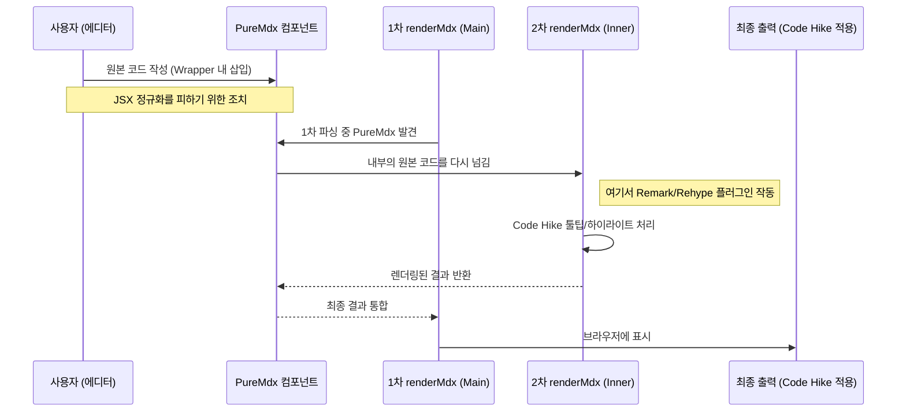

블로그를 시작할 때 지인으로부터 추천 받은 라이브러리가 있었습니다. 바로 [Code Hike](https://codehike.org/)라는 코드 블럭 라이브러리인데요. 코드 블럭을 더 예쁘게 보여준다. 이걸로 코드 블록에 툴팁도 띄우고, 탭도 띄우고, 슬라이드 쇼도 할 수 있다! 라는 엄청난 라이브러리였습니다. 안 써볼 수가 없었죠.

그런데 막상 써보니까 만족도가 높지 않더군요. 분명 멋진 라이브러리인데 왜 만족스럽지 않았을까요? 그래서 오늘은 그저 코드 블럭에 툴팁을 띄우고 싶었을 뿐인 제가 어쩌다보니 주석 파싱 시스템을 만들게 된 이야기를 공유하고자 합니다.

## 넌 멋지지만 나랑 안 맞아

앞서 말했듯 Code Hike는 멋찐 라이브러리입니다. 그런데 왜 이렇게 만족도가 떨어졌을까요? 왜 그런지 고민해봤더니 **에디터 환경에서 글을 작성하는 워크플로우**가 큰 걸림돌이었습니다.

````mdx title="Code Hike 툴팁 예제"
<CodeWithTooltips>

```js !code
// !tooltip[/lorem/] description
function lorem(ipsum, dolor = 1) {
  const sit = ipsum == null ? 0 : ipsum.sit
  dolor = sit - amet(dolor)
  // !tooltip[/consectetur/] inspect
  return sit ? consectetur(ipsum) : []
}
```

## !!tooltips description

### Hello world

Lorem ipsum **dolor** sit amet `consectetur`.

Adipiscing elit _sed_ do eiusmod.

## !!tooltips inspect

```js
function consectetur(ipsum) {
  const { a, b } = ipsum
  return a + b
}
```

</CodeWithTooltips>
````

예를 들어 Code Hike로 툴팁을 작성하기 위해서는 위와 같이 컴포넌트 내부에 코드 블럭을 작성하는 방식을 사용해야 합니다. 일반적인 마크다운에서 글을 작성한다면 문제가 없었겠지만, 저는 에디터를 사용하기 때문에 위 코드를 별도의 처리 없이 본문에 그대로 작성하면 저장 과정에서 정규화가 되어서 컴포넌트로 파싱이 되지 않습니다. 설령 된다하더라고 가독성 역시 좋지 않았죠.

그래서 커스텀 컴포넌트를 도입해 해결했습니다만, 또 다른 문제가 발생했습니다. 바로, 복잡한 렌더링 파이프라인을 거쳐야한다는 점이었습니다.



Code Hike는 remark, rehype 플러그인을 통해서 렌더링을 지원하는데 저는 에디터로 글을 작성하기 때문에 JSX를 그대로 작성하면 정규화가 되서 저장됩니다. 따라서 본문을 보존하려면 코드블록을 사용하거나 별도의 컴포넌트를 만들어서 이를 다시 MDX 렌더링 파이프라인을 타게 만들어야 했습니다… 아무리 생각해도 이건 아닌 것 같았죠.

하지만 제 에디터에는 위처럼 버젓이 <Tooltip content="나는 툴팁">툴팁</Tooltip> 버튼이 있죠. 즉, 드래그해서 툴팁 버튼만 누르면 되는걸, 심지어 에디터에서 코드 블록 안에 자동 완성도 없이 작성하자니 굉장히 별로였습니다. 문제는 에디터에서 제공되는 기본 코드블럭 컴포넌트에서는 이런 인라인 태그를 사용할 수 없다는 점이었습니다.
